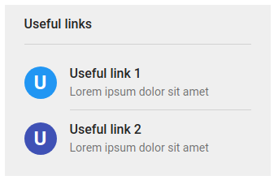
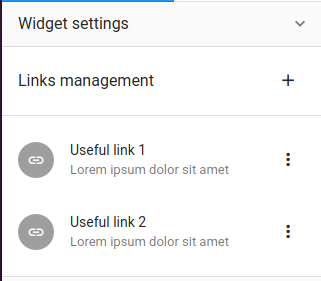

# Extension widgets

In LumApps, widgets are the main components of pages, they are used to display information to users.
You can find more information about widget with this [documentation](https://docs.lumapps.com/docs/explore-l8845750598632305).

With the Marketplace we offer our partners the capability to develop their own widgets. The extension widget will behave like any other widget, and to do so you'll have to respect the widget structure.

## Widget structure
In LumApps, widgets are composed by 2 main elements, a **widget content** and a **widget settings**; with the LumApps Marketplace we add a new element the **widget global settings**.

### Widget content

The widget content is the main component of a widget, it renders the data you want to present to the users.

In LumApps we manage content via a homemade CMS, that let user organize their page and the style of their content.
Then can customize every widget on a page using styling options available. Your extension fit this behaviour and will be customizable as well in order to fit the overall design of a page.

### Widget settings

With an extension widget you can define a settings component to let LumApps contributors set up the widget on the page, this settings are applied in "live" to the widget content.

In LumApps, these settings are render in edition mode of the page, and are sent to the widget with the "default" LumApps settings such as the style of the widget.

### Widget global settings
The widget global settings component is used by LumApps platform administrator. The settings define on this component is sent to every instance of the widget on the customer platform.
