## Supported anchors

The following section lists the different anchors that can be used for customizing LumApps. It is worth mentioning that the anchors listed here are CSS classes and IDs that are meant to be stable with each new version of LumApps. 

### Top bar

#### header

In the top bar (the top section of the page that contains the logo, the searchbox and several other icons), there are a couple of anchors that you can use in order to customize your page with CSS.

There are two anchors available on the header that will allow you to tweak the style of it. The class that surrounds the entire header is `.header-top` and there is another class that defines the maximum width of the header which is `.header-top__wrapper`.

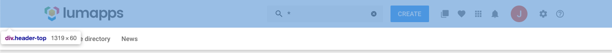

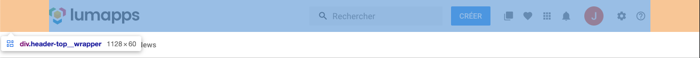

#### logo

For the logo, you can use the `.header-top__logo`.

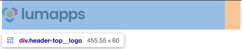

#### search box

As for the search box component, the anchor available for customization is `.header-top__search`.

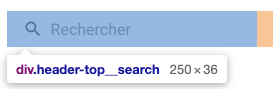

#### contribution button

When it comes to the contribution button menu, the anchor to be used is `.header-top__contribution`.

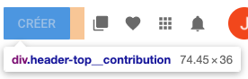

#### favorites

For the directory entries marked as favorites, you can use the `.header-top__directory-favorites`.

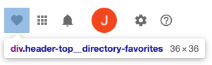

#### bookmarked apps

As for the bookmarks component, the anchor available for customization is `.header-top__bookmarked-apps`.

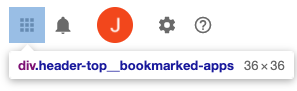

#### notifications

When it comes to the notifications icon, the anchor to be used is `.header-top__notifications`.

#### user settings

For the user settings menu, you can use the `.header-top__user-settings`.

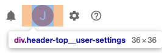

#### settings

For the settings menu, you can use the `.header-top__settings-menu`.

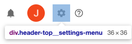

### Navigation

For the main navigation, there are several anchors that you can use for customizing your application.

`.main-nav`

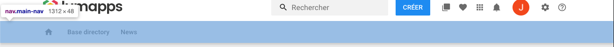

`.main-nav__root`

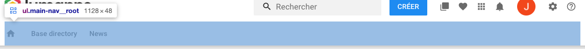

`.main-nav__wrapper`

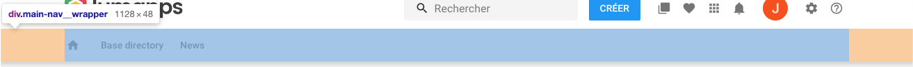

`.main-nav-item`

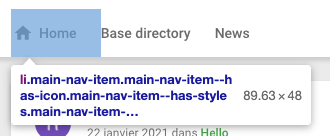

### Page

For customizing a page, you can use the id `#maincontent`,

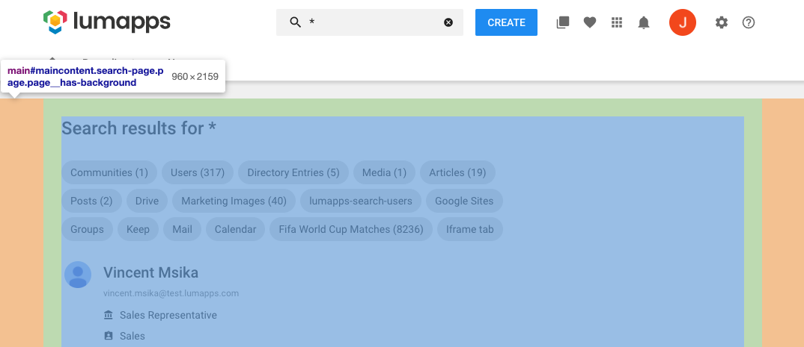