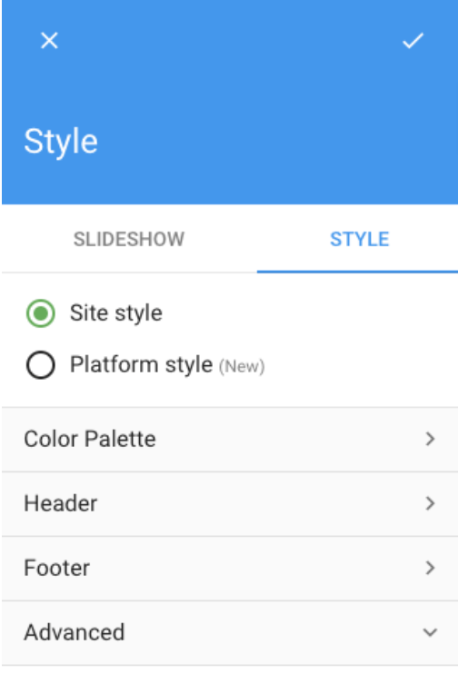

## Deployment

In order to test these customizations, as well as making them available for your platform's users, they need to be configured into your site. LumApps's approach to adding these customizations is to allow developers to insert custom CSS into their application, by adding custom stylesheets. 

To add these customizations, we will need to have access to the administration UI for LumApps platform, and have access to the Style side navigation link:
1. Go to the administration UI and click on the **Style** side navigation link.

2. Click on the **Style** tab on the tabs displayed at the top left corner of the screen and then scroll down to the **Advanced** section.

3. You will see two fields under **Advanced**, **Site theme** and **head tag (HTML)**.

4. In the **Site theme** field paste your customization.

5. We then save the change by clicking the **Save** button at the top of the style side navigation. The customization would be added to your site.

### Testing environment

If you are still developing your customization, you are free to add these customization without taking into consideration performance or overall impact. Following the procedure mentioned before will serve you just fine.

### Production environment

When deploying into production, there are several considerations that we need to have before making our customization available for our users:
- Customization size in KB: Since customizations are added as external stylesheets to your site, added code can have a direct impact on the performance of the site, mostly on the first render of the page. The more code you add as a customization, the more heavier your first initial load will be, thus taking more time to download. In order to mitigate this impact, we suggest that:
    - You minify your code before adding the CSS code in the `Site Theme` field on the Advanced settings for Style. Code minification will remove unnecessary spaces and comments and make other enhancements that will minimize the total amount of bytes added to your HTML. You can use a service like [minifier](https://www.minifier.org/) in order to minify your code and see how many bytes you are adding to the page.
    - Related to minification, you might just ask yourself, what if I want other developers or other administrators to take a look at the code on the Site Theme field and see what customizations there are? Wouldn't the minification process make this impossible to do, since the code will not be easily understandable? The answer is yes, they will not be able to read it from there. However, this is a great opportunity to rethink your current process for maintaining the customizations that you have. Code needs to be managed and versioned in order to have a reliable system, and having your code only on the Site Theme field on LumApps is not the best way to do that. Developers and other administrators should have access to your code repository, where they will be able to take a look at the code and see what you currently have customized on your site.
    - As we mentioned before, the CSS Customizations should be used only when no other customization options that LumApps provides are enough. With that in mind, the total KB added to the page by a customization should vary between 2KB and 5KB so there is no noticeable performance impact on the page. Adding code that surpases that estimated amount can potentially have an impact on the performance of your site.
- Browsers used by your users: CSS code can be executed in a variety of different browsers, each of them with functionalities that could be or not supported. With that in mind, please consider what browsers your enterprise and your users use for accessing LumApps and code accordingly. You might be using a feature that is supported in Chrome but not supported on Safari for example, and you would need to transpile your code to support both browsers. Also consider that LumApps support the latest 2 versions of Google Chrome, Firefox, Safari and Edge. IE11 is no longer supported.