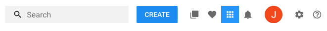

## Use Cases

### Increasing desktop page width

By default, LumApps has a default maximum width of `1128px` on the desktop version. This is usually the best width for all the different screen sizes that our users can have. However, you can change this default behavior by overriding these styles and changing the width of the site. You will need to use three of the anchors that we mentioned and change their `width` for the desktop breakpoint. If you want to know more about breakpoints, you can take a look at the [LumApps breakpoints](#lumapps-breakpoints) documentation.

It is also very important to mention that you might need to make more adjustements, depending on the configuration of your pages and how you are displaying content. Content templates and several widgets can interfere in this customization, so it would be wise to test this out through the most important pages of your site and see what works best.

1. You will first need to determine what width you would like to display your site in. Please take in consideration what devices your users use to access your site and whether changing this width will impact the display of your site in their devices. For this example, we will use the width `1280px` instead of `1128px`.

2. You will need to override the width for the `.header-top__wrapper` class for the desktop breakpoint, by changing the width to `1280px`:

```css
@media (min-width: 80em) {
    .header-top__wrapper {
        width: 1280px !important;
    }
}
```

3. Next, you will need to override the width for the `.main-nav__wrapper` class for the desktop breakpoint, by changing the width to `1280px`:

```css
@media (min-width: 80em) {
    .header-top__wrapper {
        width: 1280px !important;
    }

    .main-nav__wrapper {
        width: 1280px !important;
    }
}
```

4. Furthermore, you will need to override the width for the `#maincontent` id for the desktop breakpoint, by changing the width to `1280px`:

```css
@media (min-width: 80em) {
    .header-top__wrapper {
        width: 1280px !important;
    }

    .main-nav__wrapper {
        width: 1280px !important;
    }

    #maincontent {
        width: 1280px !important;
    }
}
```

### Change top bar icon's background color

In order to provide a different emphasis to a specific icon on the top bar, you might want to consider changing the background color of a specific icon so that it stands out from the rest. For example, we can change the bookmarked apps icon so that it displays a blue background color, with a white text. In order to do so, we need to create the following CSS:

```css
/** This changes the background color of the icon container */
.header-top__bookmarked-apps {
    background-color: #2ba0fd; /* we recommend this color to be same one as your site's primary color */
}

/** Since the new background color does not work well with the grey out of the box color for icons, we change the color of the icon as well */
.header-top__bookmarked-apps .lumx-icon {
    color: white;
}
```



### Use a custom font family

You can easily override the font family used on your site by adding a small CSS snippet that retrieves the font from a server and applies it to the site:

```css
@font-face {
    font-family: "CustomFont";
    src: url("https://yoursite.com/css/fonts/CustomFont.eot");
    src: url("https://yoursite.com/css/fonts/CustomFont.woff") format("woff"),
    url("https://yoursite.com/css/fonts/CustomFont.otf") format("opentype"),
    url("https://yoursite.com/css/fonts/CustomFont.svg#filename") format("svg");
}

html, body {
    font-family: 'CustomFont' !important;
}
```

## LumApps breakpoints

LumApps has a set of breakpoints that you will need to take into consideration when customizing your site:
- small: < 350px.
- mobile: >= 350px and < 480px.
- tablet: >= 480px and  < 1024px.
- desktop: >= 1024px and < 1280px.
- wide: >= 1280px.