# API

The main entrypoint of this API is the object ```window.lumapps```. On this object, the following functions are available:
- [customize](#customize)
- [setText](#setText)
- [disable](#disable)
- [getCurrentContent](#getCurrentContent)
- [getInternalUrl](#getInternalUrl)
- [displayNotifications](#displayNotifications)

## customize

```js
window.lumapps.customize(callback, configuration)
```

Where `callback` is a function that will receive a set of `parameters` and returns `void`. These are the `parameters` that the `callback` function expects:

| Parameter      | Description                                                                                                                                                        |
|----------------|--------------------------------------------------------------------------------------------------------------------------------------------------------------------|
| `targets`      | The different [targets](#targets) that can be customized on your site.                                                                                             |
| `placement`    | The different [placements](#placements) that can be used for positioning components on your site.                                                                  |
| `components`   | A group of [components](#components) that can be used for customizing your site.                                                                                   |
| `constants`    | A group of variables that hold the different [constants](#constants) that can be used for creating components on your site.                                        |
| `render`       | Function that allows rendering a component in a specific placement and target. See more details for this function [here](#render).                                 |
| `session`      | Object that contains several values from the current session that can be useful when creating customizations. See more details for this function [here](#session). |
| `onNavigation` | Function that will be executed once the application has performed a navigation. See more details for this function [here](#on-navigation)                          |
| `api`          | [Axios](https://github.com/axios/axios) instance that allows the developer to execute AJAX requests. See more details for this function [here](#axios-api)         |

And `configuration` is an object that allows these properties:

| Parameter                  |  Description  |
| -------------------------- | ------------- |
| `shouldRenderOnNavigation` | whether the customization callback should be executed upon navigation. If `true`, the `callback` will be executed on every navigation that the application executes. **IMPORTANT:** Please make sure that this option applies and is needed to your use case in order to avoid having an unnecessary performance impact. Normally you would not need to set it to true |
| `shouldRenderOnNavigation` |  if the customization uses data from the current content (by executing `window.lumapps.getCurrentContent()`). As of right now, other than that use case, `shouldRenderOnNavigation` should always be `false`. |

### targets

`targets` is a key/value object that holds the available targets that can be customized on LumApps. This variable allows developers to avoid figuring out which ids to use in order to customize a specific target, and it also defines the available targets that can be customized. As of now, these are the values for this object:

| Target                           | Description                                                                         | Compatibilities                                        |
|----------------------------------|-------------------------------------------------------------------------------------|--------------------------------------------------------|
| `targets.APP`                    | Target id for application                                                           | [Documentation](./capabilities#application)            |
| `targets.BOOKMARKS`              | Target id for the bookmarks/app launcher component                                  | [Documentation](./capabilities#bookmarks)              |
| `targets.COMMUNITY`              | Target id for the community pages                                                   | [Documentation](./capabilities#community)              |
| `targets.CONTENT`                | Target id for the content page                                                      | [Documentation](./capabilities#content)                |
| `targets.CONTEXTUAL_ACTIONS`     | Target id for the contextual actions menu on the right hand side of a content page. | [Documentation](./capabilities#contextual-actions)     |
| `targets.CONTRIBUTION_MENU`      | Target id for the contribution menu.                                                | [Documentation](./capabilities#contribution-menu)      |
| `targets.CONTRIBUTION_BUTTON`    | Target id for the contribution button.                                              | [Documentation](./capabilities#contribution-button)    |
| `targets.FAVORITES`              | Target id for the favorite directories.                                             | [Documentation](./capabilities#favorites)              |
| `targets.HEADER`                 | Target id for the site's header.                                                    | [Documentation](./capabilities#header)                 |
| `targets.LOGO`                   | Target id for the site's logo.                                                      | [Documentation](./capabilities#logo)                   |
| `targets.NAVIGATION`             | Target id for the main navigation.                                                  | [Documentation](./capabilities#navigation)             |
| `targets.LOGO`                   | Target id for the site's logo.                                                      | [Documentation](./capabilities#logo)                   |
| `targets.NAVIGATION`             | Target id for the main navigation.                                                  | [Documentation](./capabilities#navigation)             |
| `targets.NAVIGATION_UI`          | Target id for the main navigation's UI.                                             | [Documentation](./capabilities#navigation)             |
| `targets.NOTIFICATIONS_BUTTON`   | Target id for the notifications center component.                                   | [Documentation](./capabilities#header)                 |
| `targets.PAGE`                   | Target id for all pages.                                                            | [Documentation](./capabilities#page)                   |
| `targets.PROFILE`                | Target id for the profile page.                                                     | [Documentation](./capabilities#profile)                |
| `targets.SEARCH`                 | Target id for the search page.                                                      | [Documentation](./capabilities#search)                 |
| `targets.SEARCH_BOX`             | Target id for the search box.                                                       | [Documentation](./capabilities#search-box)             |
| `targets.SEARCH_CUSTOM_METADATA` | Target id for search custom metadata.                                               | [Documentation](./capabilities#search-custom-metadata) |
| `targets.SETTINGS`               | Target id for the settings menu.                                                    | [Documentation](./capabilities#settings)               |
| `targets.SETTINGS_BUTTON`        | Target id for the settings icon on the top bar.                                     | [Documentation](./capabilities#settings-button)        |
| `targets.STICKY_HEADER`          | Target id for the sticky header.                                                    | [Documentation](./capabilities#sticky-header)          |
| `targets.SUB_NAVIGATION`         | Target id for the sub navigation.                                                   | [Documentation](./capabilities#sub-navigation)         |
| `targets.SUB_NAVIGATION_UI`      | Target id for the sub navigation's UI.                                              | [Documentation](./capabilities#sub-navigation-ui)      |
| `targets.WIDGET`                 | Target id for a widget.                                                             | [Documentation](./capabilities#widget)                 |
| `targets.USER_PROFILE_ORG_CHART`      | Target id for the organization chart section in a user's profile.                                              | [Documentation](./capabilities#organization-chart)      |


**Note:** The Widget target needs to be used in combination with a widget id. The final target passed in into the `render` function should be `${targets.WIDGET}-${widget-id}`.

```js
window.lumapps.customize(({ targets, components, render, placement, constants }) => {
    const { Message } = components;
    const { Kind } = constants;

    render({
        placement: placement.ABOVE,
        target: 'widget-2452456502u0596839-468345',
        toRender: Message({
            className: 'widget-message',
            kind: Kind.info,
            children: 'Message above the widget 5251881089236992',
            hasBackground: true,
        }),
    });
});
```

### placements

`placement` is a key/value object that holds the available placements that can be used for customizing LumApps.

This variable allows developers to avoid figuring out which ids to use in order to customize a specific target, and it also defines the available palcements that can be customized. As of now, these are the values for this object:

| Placement           | Description                                                  |
|---------------------|--------------------------------------------------------------|
| `placement.ABOVE`   | Places the customized component at the top of the target.    |
| `placement.UNDER`   | Places the customized component at the bottom of the target. |
| `placement.LEFT`    | Places the customized component at the left of the target.   |
| `placement.RIGHT`   | Places the customized component at the right of the target.  |
| `placement.REPLACE` | Replaces the target for the customized component.            |


**Note:** not all placements are compatible with every single target. Please take a look at this compatibility in the [capabilities](./capabilities.md) documentation.

### components

#### Avatar


```js
window.lumapps.customize(({ components, constants }) => {
    const { Avatar } = components;
    const { Size } = constants;

    const component = Avatar({
        image: 'https://url.to.image.com',
        size: Size.s,
        className: 'avatar-custom-css-class'
    });
})
```

`Avatar` options:

| Option      | Description                                                         | Is required? | Option type                             | Default Value |
|-------------|---------------------------------------------------------------------|--------------|-----------------------------------------|---------------|
| `image`     | Url of the image to be used when rendering the avatar               | Yes          | `string`                                | `undefined`   |
| `size`      | Size of the avatar.                                                 | No           | [`Size`](#size)                         | `Size.m`      |
| `className` | CSS class that will be applied directly into the wrapper container. | No           | `string` or [css classes](#css-classes) | `undefined`   |

#### Badge

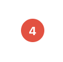

```js
window.lumapps.customize(({ components, constants }) => {
    const { Badge } = components;
    const { ColorPalette } = constants;

    const component = Badge({
        color: ColorPalette.red,
        className: 'badge-custom-css-class',
        children: '4'
    });
})
```

`Badge` options:

| Option      | Description                                                         | Is required? | Option type                             | Default Value |
|-------------|---------------------------------------------------------------------|--------------|-----------------------------------------|---------------|
| `children`  | String that will be displayed as the content of the badge.          | Yes          | `string`                                | `undefined`   |
| `size`      | Size of the avatar.                                                 | No           | [`Size`](#size)                         | `Size.m`      |
| `className` | CSS class that will be applied directly into the wrapper container. | No           | `string` or [css classes](#css-classes) | `undefined`   |

#### Button

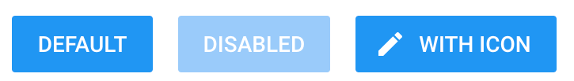

```js
window.lumapps.customize(({ components, constants }) => {
    const { Button } = components;
    const { Size, ColorPalette, Emphasis } = constants;

    const onClick = () => {
        console.log('on button click!')
    };

    const component = Button({
        children: 'Help',
        className: 'button-custom-css-class',
        leftIcon: 'help',
        onClick,
        emphasis: Emphasis.low,
    });
})
```

`Button` options:

| Option          | Description                                                           | Is required? | Option type                                   | Default Value          |
|-----------------|-----------------------------------------------------------------------|--------------|-----------------------------------------------|------------------------|
| `children`      | String that will be displayed as the content of the button.           | Yes          | `string`                                      | `undefined`            |
| `aria-label`    | Aria label to be displayed on the rendered button.                    | Yes          | string                                        | `undefined`            |
| `size`          | Size of the button.                                                   | No           | [`Size`](#size)                               | `Size.m`               |
| `className`     | CSS class that will be applied directly into the wrapper container.   | No           | `string` or [css classes](#css-classes)       | `undefined`            |
| `color`         | Color to be used for the button component.                            | No           | [`ColorPalette`](#color-palette)              | `ColorPalette.primary` |
| `onClick`       | The callback to execute when clicking on this item.                   | No           | `function`                                    | `undefined`            |
| `emphasis`      | Emphasis variant.                                                     | No           | [Emphasis](#emphasis)                         | `Emphasis.high`        |
| `hasBackground` | Whether or not the button has a background color.                     | No           | `boolean`                                     | `false`                |
| `isDisabled`    | Whether the component should be displayed in a disabled state or not. | No           | `boolean`                                     | `false`                |
| `name`          | Native button name property.                                          | No           | `string`                                      | `undefined`            |
| `href`          | Native anchorproperty. Renders a `<button>` or an `<a>` accordingly.  | No           | `string`                                      | `undefined`            |
| `target`        | To be used in combination with `href`                                 | No           | `"_self" or "_blank" or "_parent" or "_top".` | `undefined`            |
| `type`          | Native button type.                                                   | No           | `string`                                      | `undefined`            |
| `leftIcon`      | Mdi icon id to be displayed on the left hand side of the button.      | No           | [icon](#using-icons)                          | `undefined`            |
| `rightIcon`     | Mdi icon id to be displayed on the right hand side of the button.     | No           | [icon](#using-icons)                          | `undefined`            |

#### Chip


```js
window.lumapps.customize(({ components, constants }) => {
    const { Chip, Icon } = components;
    const { Size, ColorPalette, Emphasis } = constants;

    const onAfterClick = () => {
        console.log('on after chip click!')
    };

    const onClick = () => {
        console.log('on chip click!')
    };

    const component = Chip({
        className: 'chip-custom-css-class',
        after: Icon({ icon: 'close' }),
        onAfterClick,
        onClick,
        emphasis: Emphasis.low,
        color: ColorPalette.primary,
        children: 'Chip',
    });
})
```

`Chip` options:

| Option          | Description                                                                   | Is required? | Option type                             | Default Value        |
|-----------------|-------------------------------------------------------------------------------|--------------|-----------------------------------------|----------------------|
| `children`      | String that will be displayed as the content of the Chip.                     | Yes          | `string`                                | `undefined`          |
| `size`          | Size of the component.                                                        | No           | [`Size`](#size)                         | `Size.m`             |
| `className`     | CSS class that will be applied directly into the wrapper container.           | No           | `string` or [css classes](#css-classes) | `undefined`          |
| `color`         | Color to be used for the component.                                           | No           | [`ColorPalette`](#color-palette)        | `ColorPalette.light` |
| `aria-label`    | Aria label to be displayed on the rendered button.                            | Yes          | string                                  | `undefined`          |
| `onClick`       | The callback to execute when clicking on this item.                           | No           | `function`                              | `undefined`          |
| `emphasis`      | Emphasis variant.                                                             | No           | [Emphasis](#emphasis)                   | `Emphasis.high`      |
| `hasBackground` | Whether or not the button has a background color.                             | No           | `boolean`                               | `false`              |
| `after`         | Component that will be rendered inside the compononent but after `children`.  | No           | `boolean`                               | `false`              |
| `before`        | Component that will be rendered inside the compononent but before `children`. | No           | `boolean`                               | `false`              |
| `isDisabled`    | Whether the component should be displayed in a disabled state or not.         | No           | `boolean`                               | `false`              |
| `isHighlighted` | Whether the component should be displayed in a highlighted state or not.      | No           | `boolean`                               | `false`              |

#### ContextualAction

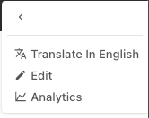

```js
window.lumapps.customize(({ targets, components, render, placement, constants }) => {
    const { ContextualAction } = components;
    /**
     * This retrieves the current displayed content, so it can be used as input for creating the customization.
     */
    const currentContent = window.lumapps.getCurrentContent();

    render({
        placement: placement.UNDER,
        target: targets.CONTEXTUAL_ACTIONS,
        toRender: ContextualAction({
            /** The action label. */
            labelKey: 'Action',
            /** The action icon to display in the contextual menu. */
            icon: 'content-copy',
            /** Whether or not the action is disabled. */
            isDisabled: false,
            /** Whether the action should appear selected or not. */
            isSelected: false,
            /** The action tooltip. */
            tooltipLabelKey: 'Do something',
            /** Since we are displaying a link and not a clickable action, we pass link properties to the `action` property in order to configure our link */
            action: {
                href: `https://external.url.com/content/${currentContent.id}`,
                target: '_blank',
            },
        }),
    });
});
```

`ContextualAction` options:

| Option            | Description                                                           | Is required? | Option type                                   | Default Value |
|-------------------|-----------------------------------------------------------------------|--------------|-----------------------------------------------|---------------|
| `labelKey`        | The action label.                                                     | Yes          | `string`                                      | `undefined`   |
| `icon`            | Mdi icon id to be displayed on the left hand side of the button.      | Yes          | [icon](#using-icons)                          | `undefined`   |
| `action`          | Object or function that will determine what the action does.          | Yes          | `function () => void;`                        | `undefined`   |
| `action.href`     | URL where the user will be redirected if they click on the action     | Yes          | `string`                                      | `undefined`   |
| `action.target`   | URL target                                                            | No           | `"_self" or "_blank" or "_parent" or "_top".` | `undefined`   |
| `isDisabled`      | Whether the component should be displayed in a disabled state or not. | No           | `boolean`                                     | `false`       |
| `isSelected`      | Whether the action should appear selected or not.                     | No           | `boolean`                                     | `false`       |
| `tooltipLabelKey` | The action tooltip.                                                   | No           | `string`                                      | `undefined`   |

#### IconButton


```js
window.lumapps.customize(({ components, constants }) => {
    const { Button } = components;
    const { Size, ColorPalette, Emphasis } = constants;

    const onClick = () => {
        console.log('on icon button click!')
    };

    const component = IconButton({
        className: 'icon-button-custom-css-class',
        icon: 'help',
        onClick,
        emphasis: Emphasis.low,
        color: ColorPalette.primary,
    });
})
```

`IconButton` options:

| Option          | Description                                                           | Is required? | Option type                                   | Default Value          |
|-----------------|-----------------------------------------------------------------------|--------------|-----------------------------------------------|------------------------|
| `icon`          | Mdi icon id to be displayed.                                          | Yes          | [icon](#using-icons)                          | `undefined`            |
| `aria-label`    | Aria label to be displayed on the rendered button.                    | Yes          | string                                        | `undefined`            |
| `size`          | Size of the component.                                                | No           | [`Size`](#size)                               | `Size.m`               |
| `className`     | CSS class that will be applied directly into the wrapper container.   | No           | `string` or [css classes](#css-classes)       | `undefined`            |
| `color`         | Color to be used for the button component.                            | No           | [`ColorPalette`](#color-palette)              | `ColorPalette.primary` |
| `onClick`       | The callback to execute when clicking on this item.                   | No           | `function`                                    | `undefined`            |
| `emphasis`      | Emphasis variant.                                                     | No           | [Emphasis](#emphasis)                         | `Emphasis.high`        |
| `hasBackground` | Whether or not the button has a background color.                     | No           | `boolean`                                     | `false`                |
| `isDisabled`    | Whether the component should be displayed in a disabled state or not. | No           | `boolean`                                     | `false`                |
| `name`          | Native button name property.                                          | No           | `string`                                      | `undefined`            |
| `href`          | Native anchorproperty. Renders a `<button>` or an `<a>` accordingly.  | No           | `string`                                      | `undefined`            |
| `target`        | To be used in combination with `href`                                 | No           | `"_self" or "_blank" or "_parent" or "_top".` | `undefined`            |
| `type`          | Native button type.                                                   | No           | `string`                                      | `undefined`            |

#### Icon

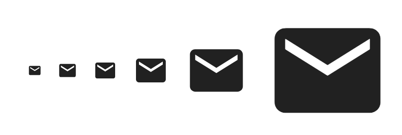

```js
window.lumapps.customize(({ components, constants }) => {
    const { Icon } = components;
    const { Size, ColorPalette } = constants;

    const component = Icon({
        className: 'icon-custom-css-class',
        icon: 'help',
        color: ColorPalette.primary,
        hasShape: true,
    });
})
```

`Icon` options:

| Option      | Description                                                                           | Is required? | Option type                             | Default Value          |
|-------------|---------------------------------------------------------------------------------------|--------------|-----------------------------------------|------------------------|
| `icon`      | Mdi icon id to be displayed.                                                          | Yes          | [icon](#using-icons)                    | `undefined`            |
| `size`      | Size of the component.                                                                | No           | [`Size`](#size)                         | `Size.m`               |
| `className` | CSS class that will be applied directly into the wrapper container.                   | No           | `string` or [css classes](#css-classes) | `undefined`            |
| `color`     | Color to be used for the button component.                                            | No           | [`ColorPalette`](#color-palette)        | `ColorPalette.primary` |
| `hasShape`  | Boolean that represents whether or not the button has a round shape around it or not. | No           | `boolean`                               | `false`                |

#### FlexBox

The FlexBox component is a helper component that allows displaying multiple components using a `flexbox` display, in order to minimize the amount of CSS that needs to be added in order to display your components in a certain way.

```js
window.lumapps.customize(({ components, constants }) => {
    const { Chip, Icon, FlexBox } = components;
    const { Orientation } = constants;

    const component = FlexBox({
        children: [
            Chip({ children: 'Chip 1' }),
            Chip({ children: 'Chip 2' }),
            Chip({ children: 'Chip 3' }),
        ],
        orientation: Orientation.horizontal
    });
})
```

`FlexBox` options:

| Option        | Description                                                                                  | Is required? | Option type                             | Default Value |
|---------------|----------------------------------------------------------------------------------------------|--------------|-----------------------------------------|---------------|
| `children`    | Single component or list of components that will be rendered inside the `FlexBox` component. | Yes          | Component or Component[]                | `undefined`   |
| `orientation` | Orientation to be used for displaying the provided components.                               | No           | [Orientation](#orientation)             | `undefined`   |
| `className`   | CSS class that will be applied directly into the wrapper container.                          | No           | `string` or [css classes](#css-classes) | `undefined`   |
| `fillSpace`   | Boolean that determines whether the "content filling space" is enabled or not.               | No           | `boolean`                               | `false`       |
| `noShrink`    | Boolean that determines whether the "content shrink" is disabled or not.                     | No           | `boolean`                               | `false`       |
| `wrap`        | Boolean that determines whether the "flex wrap" is enabled or not.                           | No           | `boolean`                               | `false`       |
| `gapSize`     | Boolean that determines whether the "flex wrap" is enabled or not.                           | No           | boolean`                                | `undefined`   |
| `hAlign`      | Flex horizontal alignment.                                                                   | No           | [Alignment](#alignment)                 | `undefined`   |
| `vAlign`      | Flex vertical alignment.                                                                     | No           | [Alignment](#alignment)                 | `undefined`   |

#### Dropdown

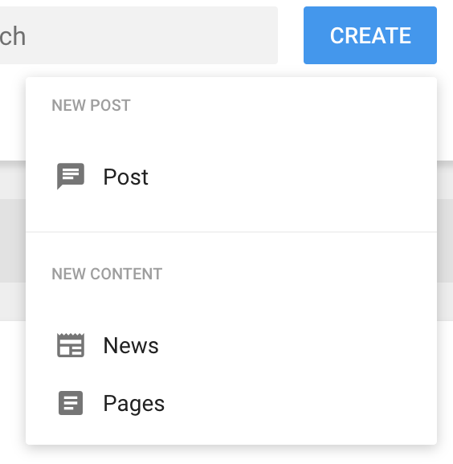

```js
window.lumapps.customize(({ components }) => {
    const { DropdownSection, DropdownItem, Dropdown } = components;

    const component = Dropdown({
            children: DropdownSection({
                children: [
                    DropdownItem({
                        title: 'Google Drive',
                        icon: 'google-drive',
                        href: 'https://drive.google.com/',
                    }),
                    DropdownItem({
                        title: 'Google Docs',
                        icon: 'text-box',
                        href: 'https://docs.google.com/document',
                    }),
                    DropdownItem({
                        title: 'Google Slides',
                        icon: 'play-box-outline',
                        href: 'https://docs.google.com/presentation/',
                    }),
                ],
                header: 'Google',
            }),
            label: 'Utils',
        }),
    });
});
```

`Dropdown` options:

| Option             | Description                                                                                  | Is required? | Option type                             | Default Value |
|--------------------|----------------------------------------------------------------------------------------------|--------------|-----------------------------------------|---------------|
| `children`         | Single component or list of components that will be rendered inside the `Dropdown` component.| Yes          | Component or Component[]                | `undefined`   |
| `label`            | String to be displayed on the button that triggers the dropdown.                             | Yes          | `string`                                | `undefined`   |
| `className`        | CSS class that will be applied directly into the wrapper container.                          | No           | `string` or [css classes](#css-classes) | `undefined`   |
| `buttonProps`      | Properties that will be passed to the button component that triggers the dropdwon.           | No           | [button options](#button)               | `undefined`   |
| `onClose`          | Callback to be executed once the dropdown is closed.                                         | No           | `function () => void`                   | `undefined`   |
| `closeOnClickAway` | Boolean that determines whether a click anywhere out of the Dropdown would close it or not.  | No           | `boolean`                               | `false`       |
| `closeOnClick`     | Boolean that determines whether to close the Dropdown when clicking in it or not.            | No           | `boolean`                               | `false`       |
| `closeOnEscape`    | Boolean that determines whether an escape key press would close the Dropdown or not.         | No           | `boolean`                               | `false`       |

`DropdownSection` options:

| Option     | Description                                                                                          | Is required? | Option type              | Default Value |
|------------|------------------------------------------------------------------------------------------------------|--------------|--------------------------|---------------|
| `children` | Single component or list of components that will be rendered inside the `DropdownSection` component. | Yes          | Component or Component[] | `undefined`   |
| `header`   | Text that will be displayed as the title of the dropdown section.                                    | Yes          | `string`                 | `undefined`   |

`DropdownItem` options:

| Option         | Description                                                                 | Is required? | Option type                             | Default Value |
|----------------|-----------------------------------------------------------------------------|--------------|-----------------------------------------|---------------|
| `title`        | Text to be displayed on the `DropdownItem` component.                       | Yes          | `string`                                | `undefined`   |
| `href`         | Link that the user will be redirected to when the dropdown item is clicked. | Yes          | `string`                                | `undefined`   |
| `onClick`      | Callback to be executed when clicking on this item.                         | No           | `function () => void`                   | `undefined`   |
| `icon`         | Mdi icon id to be displayed.                                                | No           | [icon](#using-icons)                    | `undefined`   |
| `className`    | CSS class that will be applied directly into the wrapper container.         | No           | `string` or [css classes](#css-classes) | `undefined`   |
| `openInNewTab` | Boolean that determines whether the link should be opened in a new tab.     | No           | `boolean`                               | `false`       |

#### Link

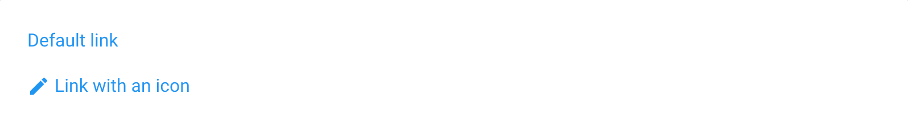

```js
window.lumapps.customize(({ components }) => {
    const { Link } = components;

    const component = Link({
        children: 'Link text',
        href: 'https://google.com',
    });
});
```

`Link` options:

| Option     | Description                                                        | Is required? | Option type                                   | Default Value          |
|------------|--------------------------------------------------------------------|--------------|-----------------------------------------------|------------------------|
| `children` | Text to be displayed on the `Link` component.                      | Yes          | `string`                                      | `undefined`            |
| `href`     | Link that the user will be redirected to when the link is clicked. | Yes          | `string`                                      | `undefined`            |
| `color`    | Color to be used for the button component.                         | No           | [`ColorPalette`](#color-palette)              | `ColorPalette.primary` |
| `target`   | To be used in combination with `href`                              | No           | `"_self" or "_blank" or "_parent" or "_top".` | `undefined`            |

#### List

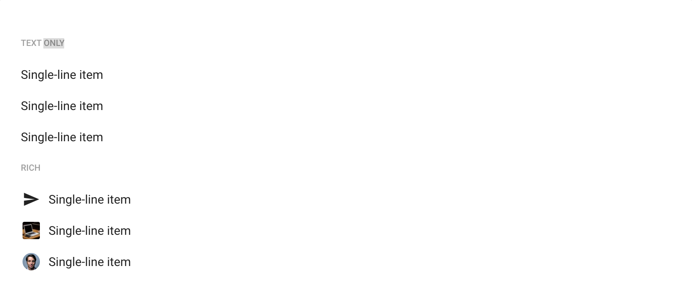

```js
window.lumapps.customize(({ targets, components, constants }) => {
    const { List, ListItem, ListDivider, ListSubheader, Icon } = components;
    const { Size } = constants;

    const onCopyClick = () => {
        console.log('on copy clicked');
    }

    const component = List({
        children: [
            ListSubheader({ children: 'Copy Actions' }),
            ListItem({
                children: 'Copy',
                'aria-label': 'Copy',
                size: Size.tiny,
                onItemSelected: onCopyClick,
                href: '/copy'
                before: Icon({
                    icon: 'content-copy',
                    size: Size.xs,
                }),
            }),
            ListDivider(),
            ListSubheader({ children: 'Share' }),
            ListItem({
                children: 'Share to Slack',
                'aria-label': 'Share to Slack',
                size: Size.tiny,
                before: Icon({
                    icon: 'share',
                    size: Size.xs,
                }),
            }),
            ListItem({
                children: 'Share to Linkedin',
                'aria-label': 'Share to Linkedin',
                size: Size.tiny,
                before: Icon({
                    icon: 'share',
                    size: Size.xs,
                }),
            }),
        ]
    });
});
```

`List` options:

| Option      | Description                                                                               | Is required? | Option type                             | Default Value |
|-------------|-------------------------------------------------------------------------------------------|--------------|-----------------------------------------|---------------|
| `children`  | Single component or list of components that will be rendered inside the `List` component. | Yes          | Component or Component[]                | `undefined`   |
| `className` | CSS class that will be applied directly into the wrapper container.                       | No           | `string` or [css classes](#css-classes) | `undefined`   |

`ListDivider` has no options.

`ListSubheader` options:

| Option      | Description                                                         | Is required? | Option type                             | Default Value |
|-------------|---------------------------------------------------------------------|--------------|-----------------------------------------|---------------|
| `children`  | Text that will be displayed inside the ListSubheader.               | Yes          | `string`                                | `undefined`   |
| `className` | CSS class that will be applied directly into the wrapper container. | No           | `string` or [css classes](#css-classes) | `undefined`   |

`ListItem` options:

| Option           | Description                                                                 | Is required? | Option type                             | Default Value |
|------------------|-----------------------------------------------------------------------------|--------------|-----------------------------------------|---------------|
| `children`       | String that will be rendered inside the list item.                          | Yes          | `string`                                | `undefined`   |
| `className`      | CSS class that will be applied directly into the wrapper container.         | No           | `string` or [css classes](#css-classes) | `undefined`   |
| `after`          | Component that will be rendered inside the list item but after `children`.  | No           | Component                               | `undefined`   |
| `before`         | Component that will be rendered inside the list item but before `children`. | No           | Component                               | `undefined`   |
| `className`      | CSS class that will be applied directly into the wrapper container.         | No           | `string` or [css classes](#css-classes) | `undefined`   |
| `onItemSelected` | Callback to be executed when clicking on this item.                         | No           | `function () => void`                   | `undefined`   |
| `isDisabled`     | Whether the component should be displayed in a disabled state or not.       | No           | `boolean`                               | `false`       |
| `size`           | Size of the component.                                                      | No           | [`Size`](#size)                         | `Size.m`      |
| `isHighlighted`  | Whether the component should be displayed in a highlighted state or not.    | No           | `boolean`                               | `false`       |

#### Message

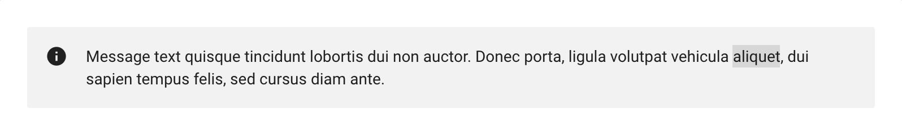

```js
window.lumapps.customize(({ components, constants }) => {
    const { Message } = components;
    const { Kind } = constants;

    const component = Message({
        className: 'general-message',
        kind: Kind.info,
        children: 'Message above all pages',
        hasBackground: true,
    });
});
```

`Message` options:

| Option          | Description                                                                           | Is required? | Option type                             | Default Value |
|-----------------|---------------------------------------------------------------------------------------|--------------|-----------------------------------------|---------------|
| `children`      | String that will be rendered inside the message.                                      | Yes          | `string`                                | `undefined`   |
| `kind`          | Message kind, which will determine the look and feel of the final rendered component. | Yes          | [Kind](#kind)                           | `undefined`   |
| `className`     | CSS class that will be applied directly into the wrapper container.                   | No           | `string` or [css classes](#css-classes) | `undefined`   |
| `hasBackground` | Whether or not the button has a background color.                                     | No           | `boolean`                               | `false`       |

#### Card

The `Card` component is a simple layout component used to display content in a frame with a default background and padding.

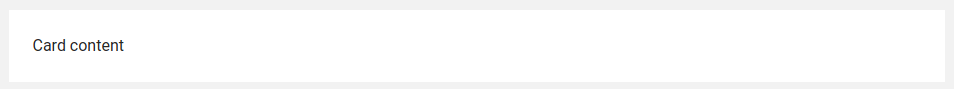

```js
window.lumapps.customize(({ components, constants }) => {
    const { Card } = components;
    const { Kind } = constants;

    const component = Card({
        className: 'general-card',
        children: 'Card content',
        as: 'section',
    });

});
```

`Card` options:

| Option          | Description                                                                           | Is required? | Option type                             | Default Value |
|-----------------|---------------------------------------------------------------------------------------|--------------|-----------------------------------------|---------------|
| `children`    | Single component or list of components that will be rendered inside the `Card` component. | Yes          | Component or Component[]                | `undefined`   |
| `className`     | CSS class that will be applied directly into the wrapper container.                   | No           | `string` or [css classes](#css-classes) | `undefined`   |
| `as` | The element to use instead of `section`                                    | No           | `string`                               | `article`       |

#### RawHTML

RawHTML is a helper component that can be used when we need to render a specific HTML structure that cannot be achieved without using the out-of-the-box components of the Customizations API. It is definitely a powerful component, since it allows rendering any HTML whatsoever. However, since it does not use anything from the provided components, the HTML generated does not reuse any styles and does not maintain a visual coherence with the page and the other components displayed on it.

```js
window.lumapps.customize(({ components }) => {
    const { RawHTML } = components;

    const component = RawHTML({
        html: '<span>This is a custom HTML</span>'
    });
});
```

`RawHTML` options:

| Option      | Description                                                         | Is required? | Option type                             | Default Value |
|-------------|---------------------------------------------------------------------|--------------|-----------------------------------------|---------------|
| `html`      | HTML to render.                                                     | Yes          | `string`                                | `undefined`   |
| `className` | CSS class that will be applied directly into the wrapper container. | No           | `string` or [css classes](#css-classes) | `undefined`   |

#### Thumbnail

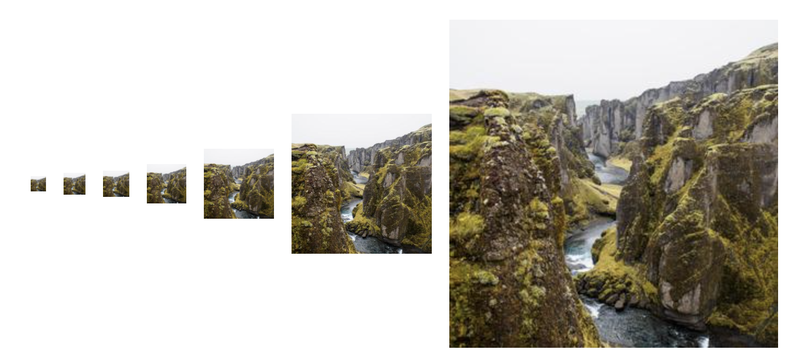

```js
window.lumapps.customize(({ components, constants }) => {
    const { Thumbnail } = components;
    const { Size, ThumbnailVariant } = constants;

    const component = Thumbnail({
        image: 'https://url.to.image',
        size: Size.m,
        variant: ThumbnailVariant.rounded,
    });
});
```

`Thumbnail` options:

| Option      | Description                                                         | Is required? | Option type                             | Default Value |
|-------------|---------------------------------------------------------------------|--------------|-----------------------------------------|---------------|
| `image`     | URL of the image to be displayed.                                   | Yes          | `string`                                | `undefined`   |
| `className` | CSS class that will be applied directly into the wrapper container. | No           | `string` or [css classes](#css-classes) | `undefined`   |
| `size`      | Size of the component.                                              | No           | [`Size`](#size)                         | `Size.m`      |
| `variant`   | Border variant for the image.                                       | No           | [ThumbnailVariant](#thumbnail-variant)  | `undefined`   |

#### Dialog

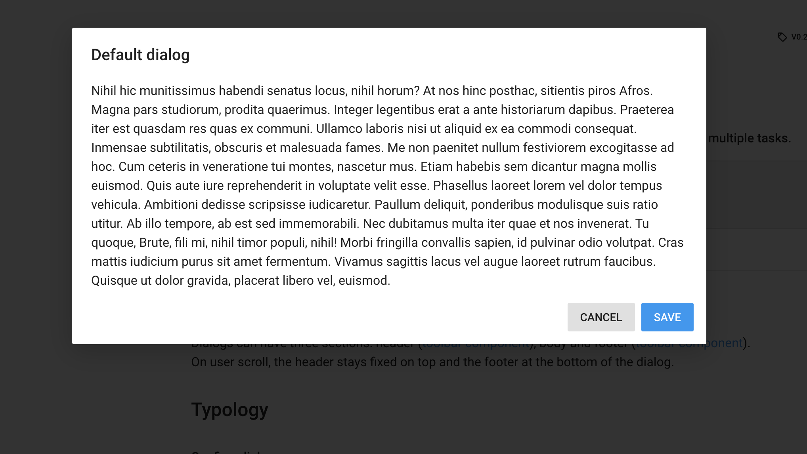

```js
window.lumapps.customize(({ components }) => {
    const { RawHTML, Dialog } = components;

   const component = Dialog({
        isOpen: true,
        header: RawHTML({ html: '<span class="lumx-typography-title">Welcome to your site\'s on boarding message!</span>' }),
        accept: {
            label: 'OK',
            onClick: onAccept,
        },
        body: RawHTML({
            html: `
                <p>
                    A warm welcome and lots of good wishes on becoming part of our growing team. Congratulations and on behalf of all the members. We are all happy and excited about your inputs and contribution to our company!
                </p>
                <br/>
            `,
        }),
    });
});
```

`Dialog` options:

| Option         | Description                                                                                              | Is required? | Option type              | Default Value |
|----------------|----------------------------------------------------------------------------------------------------------|--------------|--------------------------|---------------|
| `body`         | Single component or list of components that will be rendered inside the `Dialog` component.              | Yes          | Component or Component[] | `undefined`   |
| `header`       | Single component or string that will be rendered at the top of the modal, as the header.                 | Yes          | Component or Component[] | `undefined`   |
| `accept`       | Options that will impact the look and feel of the button displayed on the right bottom side of the page. | Yes          | [Button](#button)        | `undefined`   |
| `accept.label` | Text that will be displayed inside the button. If not set, the button is not rendered.                   | Yes          | string                   | `undefined`   |
| `cancel`       | Options that will impact the look and feel of the button displayed on the right bottom side of the page. | Yes          | [Button](#button)        | `undefined`   |
| `cancel.label` | Text that will be displayed inside the button. If not set, the button is not rendered.                   | Yes          | string                   | `undefined`   |
| `isOpen`       | Whether the modal should be opened or not.                                                               | No           | `boolean`                | `false`       |
| `onClose`      | Callback to be executed once the modal is closed.                                                        | No           | `function () => void`    | `undefined`   |
| `size`         | Size of the component.                                                                                   | No           | [`Size`](#size)          | `Size.m`      |


**IMPORTANT:** The Dialog component is meant to be used only one time during the life cycle of a user's session. Meaning that this Dialog will be displayed, the user will close it, and the Dialog will not display again during the user's session. Reusing a Dialog and displaying it multiple times once it has already been closed is not supported.

#### Skeletons

Skeleton are primitives shapes which mimic a piece of content in a recognizable way. It communicate loading states. There are three variants:

Circular Skeleton:

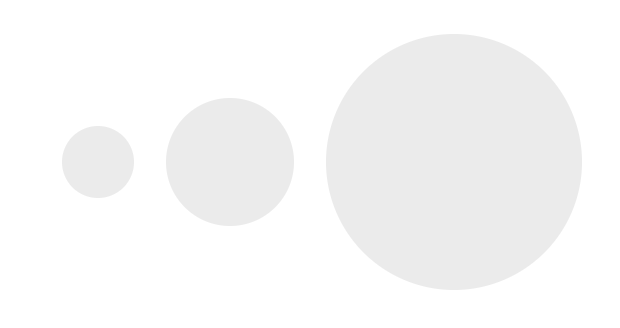

```js
window.lumapps.customize(({ components, constants }) => {
    const { SkeletonCircle } = components;
    const { Size } = constants;

   const component = SkeletonCircle({
        size: Size.m,
    });
});
```

| Option      | Description                                                         | Is required? | Option type                             | Default Value |
|-------------|---------------------------------------------------------------------|--------------|-----------------------------------------|---------------|
| `size`      | Size of the component.                                              | No           | [`Size`](#size)                         | `Size.m`      |

Rectangular Skeleton:

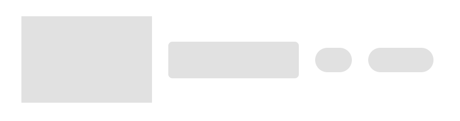

```js
window.lumapps.customize(({ components, constants }) => {
    const { SkeletonRectangle } = components;
    const { Size } = constants;

   const component = SkeletonRectangle({
        width: Size.m,
        height: Size.m,
    });
});
```

| Option    | Description               | Is required? | Option type                      | Default Value |
|-----------|---------------------------|--------------|----------------------------------|---------------|
| `width`   | Width of the component.   | Yes          | [`Size`](#size)                  | `undefined`   |
| `height`  | Height of the component.  | Yes          | [`Size`](#size)                  | `undefined`   |
| `variant` | Variant of the component. | Yes          | `squared` or `rounded` or `pill` | `squared`     |

Typography Skeleton:


```js
window.lumapps.customize(({ components, constants }) => {
    const { SkeletonTypography } = components;
    const { Typography } = constants;

   const component = SkeletonTypography({
        typography: Typography.headline,
    });
});
```

| Option       | Description         | Is required? | Option type                 | Default Value |
|--------------|---------------------|--------------|-----------------------------|---------------|
| `typography` | Typography variant. | Yes          | [`Typography`](#typography) | `undefined`   |

### constants

#### Alignment

```js
window.lumapps.customize(({ constants }) => {
    const { Alignment } = constants;
});
```

| Option                   | Description                                                                                       |
|--------------------------|---------------------------------------------------------------------------------------------------|
| `Alignment.bottom`       | Aligns items to the bottom of the flexbox container.                                              |
| `Alignment.center`       | Aligns items to the center of the flexbox container.                                              |
| `Alignment.top`          | Aligns items to the top of the flexbox container.                                                 |
| `Alignment.end`          | Aligns items at the end of the flexbox container.                                                 |
| `Alignment.start`        | Aligns items at the start of the flexbox container.                                               |
| `Alignment.spaceBetween` | Distributes items evenly. The first item is flush with the start, the last is flush with the end. |
| `Alignment.spaceAround`  | Distributes items evenly. Items have a half-size space on either end.                             |

#### ColorPalette

```js
window.lumapps.customize(({ constants }) => {
    const { ColorPalette } = constants;
});
```

`ColorPalette` is a key/value object that provides the possible colors for a component.

| Option                   | Description                                                                                                            | Color                               |
|--------------------------|------------------------------------------------------------------------------------------------------------------------|-------------------------------------|
| `ColorPalette.primary`   | Will use the primary color that has been set for your site.                                                            |                                     |
| `ColorPalette.secondary` | Will use the secondary color that has been set for your site.                                                          |                                     |
| `ColorPalette.dark`      | Will use the dark theme as the color the component. This is the default value for all components.                      | 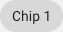   |
| `ColorPalette.light`     | Will use the light theme as the color of the component. Best used when the background container has a very dark color. |   |
| `ColorPalette.yellow`    | Will use the yellow LumApps color as the color of the component.                                                       | 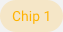 |
| `ColorPalette.blue`      | Will use the blue LumApps color as the color of the component.                                                         | 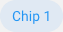   |
| `ColorPalette.red`       | Will use the red LumApps color as the color of the component.                                                          | 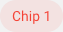    |
| `ColorPalette.green`     | Will use the green LumApps color as the color of the component.                                                        | 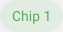  |
| `ColorPalette.grey`      | Will use the grey LumApps color as the color of the component.                                                         |    |

#### Emphasis

```js
window.lumapps.customize(({ constants }) => {
    const { Emphasis } = constants;
});
```

`Emphasis` is a key/value object that provides the possible emphasis for a component.

| Option               | Description                                                            | Emphasis                                |
|----------------------|------------------------------------------------------------------------|-----------------------------------------|
| `Emphasis.primary`   | Determines that the button should be displayed with a high emphasis.   | 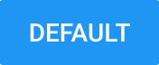    |
| `Emphasis.secondary` | Determines that the button should be displayed with a medium emphasis. |   |
| `Emphasis.dark`      | Determines that the button should be displayed with a low emphasis.    |      |

#### Kind

```js
window.lumapps.customize(({ constants }) => {
    const { Kind } = constants;
});
```

`Kind` is a key/value object that provides the possible kinds for a component. Mostly used for the `Message` component.

| Option         | Description                                                            | Kind                                |
|----------------|------------------------------------------------------------------------|-------------------------------------|
| `Kind.info`    | Determines that the message should be displayed with the kind info.    | 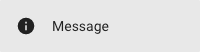    |
| `Kind.success` | Determines that the message should be displayed with the kind success. | 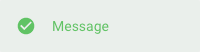 |
| `Kind.error`   | Determines that the message should be displayed with the kind error.   | 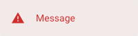   |
| `Kind.warning` | Determines that the message should be displayed with the kind warning. | 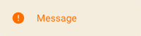 |

#### Orientation

```js
window.lumapps.customize(({ constants }) => {
    const { Orientation } = constants;
});
```

`Orientation` is a key/value object that provides the possible orientations for a component. Mostly used for the `FlexBox` component.

| Option                   | Description                                                                                      | Orientation                                   |
|--------------------------|--------------------------------------------------------------------------------------------------|-----------------------------------------------|
| `Orientation.horizontal` | Determines that components on the flexbox will be displayed horizontally one next to each other. | 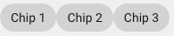 |
| `Orientation.vertical`   | Determines that components on the flexbox will be displayed vertically one next to each other.   | 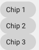   |

#### Size

```js
window.lumapps.customize(({ constants }) => {
    const { Size } = constants;
});
```

`Size` is a key/value object that provides the possible sizes for a component.

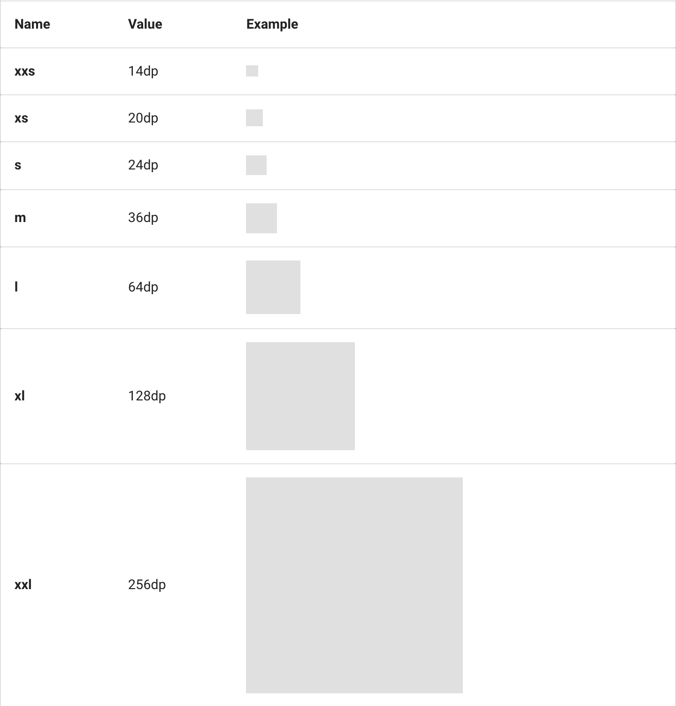

#### ThumbnailVariant

```js
window.lumapps.customize(({ constants }) => {
    const { ThumbnailVariant } = constants;
});
```

`ThumbnailVariant` is a key/value object that provides the possible variants for a thumbnail

| Option                     | Description                                                   |
|----------------------------|---------------------------------------------------------------|
| `ThumbnailVariant.squared` | Determines that thumbnail is displayed with a square border.  |
| `ThumbnailVariant.rounded` | Determines that thumbnail is displayed with a rounded border. |


### render

The `render` function allows to display components in a specific placement targetting a specific target. It has two use cases:
- Render components without a context.
- Render component with a context

The `render` function can be executed in order to create components that will be displayed in a given placement and target.

```js
window.lumapps.customize(({ targets, components, render, placement, constants }) => {
    const { Message } = components;
    const { Kind } = constants;

    render({
        placement: placement.ABOVE,
        target: targets.PAGE,
        /**
         * Message has no relation with the context of the page.
         */
        toRender: Message({
            className: 'general-message',
            kind: Kind.info,
            children: 'Message above all pages',
            hasBackground: true,
        }),
    });
});
```

`render` is a function that allows rendering a component in a specific `target` and `placement`. The `render` function accepts an object with the following properties:

| Option      | Description                                                                                  | Is required? | Option type              | Default Value |
|-------------|----------------------------------------------------------------------------------------------|--------------|--------------------------|---------------|
| `placement` | Where the custom component should be rendered at the specific target.                        | Yes          | [Placement](#placement)  | `undefined`   |
| `target`    | What section of the LumApps application is targeted by this customization.                   | Yes          | [Target](#targets)       | `undefined`   |
| `toRender`  | Single component or list of components that will be rendered at the `target` and `placement`. | Only  if `toRenderWithContext` is `undefined`        | Component or Component[] | `undefined`   |
| `toRenderWithContext`  | Same as `toRender` but expects a function that will receive additional context specific to the given `target`.  | Only if `toRender` is `undefined`          | Function | `undefined`   |

### Context compatible targets
If the target allows it, the `toRenderWithContext` properties allows to render a component using additionnal context.

The `render` function can be executed in order to create components that will be displayed in a given placement and target.

```js
window.lumapps.customize(({ targets, components, render, placement, constants }) => {
    const { Card, Message } = components;
    const { Kind } = constants;

    render({
        placement: placement.ABOVE,
        target: targets.USER_PROFILE_ORG_CHART,
        /**
         * The card can use the displayed user's data.
         */
        toRenderWithContext: (context) => {
            return Card({
                className: 'user-about-page__article',
                children: [
                    Message({
                        kind: Kind.info,
                        children: `Welcome to ${context.user.fullName}'s profile`,
                        hasBackground: true,
                    }),
                ],
            });
        },
    });
});
```

Here are the compatible targets and their received context:

#### [Organization chart context](./capabilities#organization-chart)


| Option      | Description | Option type |
|-------------| ----------- | ------------ |
 `user`  |  The currently displayed user's data.| `object`

 `user` options:

 | Option      | Description | Option type |
|-------------| ----------- | ------------ |
 `id`  |  The user's id.| `string`
 `primaryEmail`  |  The user's email.| `string`
 `profilePictureUrl`  |  The user's profile picture.| `string`
 `firstName`  |  The user's first name.| `string`
 `lastName`  |  The user's last name.| `string`
 `fullName`  |  The user's full name, formatted using the current user's locale.| `string`


### session

```js
window.lumapps.customize(({ targets, components, render, placement, constants, session }) => {
    const { Message } = components;
    const { Kind } = constants;

    render({
        placement: placement.ABOVE,
        target: targets.PAGE,
        toRender: Message({
            className: 'general-message',
            kind: Kind.info,
            children: `Welcome ${session.user.firstName}!`,
            hasBackground: true,
        }),
    });
});
```

The `session` object is a key/value object that allows obtaining information from the current user's session. It is useful when the customizations that we are building need to be configured by the context in which they are executed

#### session.device

Contains information related to the current device used to display LumApps.

| Option                     | Description                                                              | Option type |
|----------------------------|--------------------------------------------------------------------------|-------------|
| `session.device.isSmall`   | Whether the current device is a small (< 350px) device.                  | `boolean`   |
| `session.device.isMobile`  | Whether the current device is a mobile (>= 350px and < 480px) device.    | `boolean`   |
| `session.device.isDesktop` | Whether the current device is a desktop (>= 1024px and < 1280px) device. | `boolean`   |
| `session.device.isWide`    | Whether the current device is a wide ( >= 1280px) device.                | `boolean`   |

#### session.instance

Contains information related to the current instance (also known as site).

| Option                                     | Description                                                | Option type                                                                      |
|--------------------------------------------|------------------------------------------------------------|----------------------------------------------------------------------------------|
| `session.instance.id`                      | ID of the current instance.                                | `string`                                                                         |
| `session.instance.slug`                    | Slug of the current instance.                              | `string`                                                                         |
| `session.instance.subtitle`                | Subtitle of the current instance.                          | Key/value object where the key is a language id and the value is the translation |
| `session.instance.title`                   | Title of the current instance.                             | Key/value object where the key is a language id and the value is the translation |
| `session.instance.isDefaultInstance`       | Whether the current instance is the default one.           | `boolean`                                                                        |
| `session.instance.publicContentAuthorized` | Whether the current instance allows public content or not. | `boolean`                                                                        |
| `session.instance.langs`                   | List of the configured languages for the current instance. | `string[]`                                                                       |
| `session.instance.name`                    | Name of the current instance.                              | `boolean`                                                                        |
| `session.instance.logo`                    | Logo of the current instance.                              | `boolean`                                                                        |
| `session.instance.parent`                  | Parent id of the current instance.                         | `boolean`                                                                        |

#### session.isConnected

Boolean that shows whether the current user is connected or not.

#### session.language

Id of the language currently used to display the site for the current user.

#### session.organization

Contains information related to the current organization (also known as customer).

| Option                                 | Description                                            | Option type |
|----------------------------------------|--------------------------------------------------------|-------------|
| `session.organization.id`              | ID of the current organization.                        | `string`    |
| `session.organization.slug`            | Slug of the current organization.                      | `string`    |
| `session.organization.name`            | Name of the current organization.                      | `string`    |
| `session.organization.enabledFeatures` | List of enabled features for the current organization. | `string[]`  |

#### session.user

Contains information related to the current logged in user.

| Option                             | Description                                                              | Option type                                                      |
|------------------------------------|--------------------------------------------------------------------------|------------------------------------------------------------------|
| `session.user.id`                  | ID of the current user.                                                  | `string`                                                         |
| `session.user.firstName`           | First name of the current user.                                          | `string`                                                         |
| `session.user.lastName`            | Last name of the current user.                                           | `string`                                                         |
| `session.user.fullName`            | Full name of the current user.                                           | `string`                                                         |
| `session.user.isAdmin`             | Whether the current user is an admin of the current instance or not.     | `boolean`                                                        |
| `session.user.instancesSuperAdmin` | Instances id where the current user is admin.                            | `string[]`                                                       |
| `session.user.isSuperAdmin`        | Whether the current user is an admin of the current organization or not. | `boolean`                                                        |
| `session.user.lang`                | Default language for the current user.                                   | `string`                                                         |
| `session.user.langs`               | Alternative languages for the current user.                              | `string[]`                                                       |
| `session.user.primaryEmail`        | Primary email of the current user.                                       | `string[]`                                                       |
| `session.user.profilePictureUrl`   | Profile picture URL of the current user.                                 | `string[]`                                                       |
| `session.user.emails`              | Emails associated to the current user.                                   | `Email[]` where Email is `{ address: string; primary: boolean }` |

#### session.navigations

Contains two `Promises`, one for the main navigation and another one for the subnavigation, that allow to retrieve the navigation items displayed on the site. These promises are fulfilled once the data is retrieved by the LumApps web application.

| Promise                     | Description                                                   |    Returned type |
|-----------------------------|---------------------------------------------------------------|-------------------|
| `session.navigations.getCurrent` | Retrieves a promise that fulfills with the information needed to render the main navigation of the site. If the main navigation inheritance feature is activated and the site has a parent site, this promise will return the data to render the site's sub navigation. | `NavigationItem[]`  |
| `session.navigations.getParent` | Retrieves a promise that fulfills with the information needed to render the parent navigation of the site. If the main navigation inheritance feature is activated and the site has a parent site, this promise will be defined. If that is not the case, then this promise will be `null` | `NavigationItem[]`  |

`NavigationItem`

| Option                          | Description                                                                                               | Option type              |
|---------------------------------|-----------------------------------------------------------------------------------------------------------|--------------------------|
| `navigationItem.id`             | Navigation item id, which is the ID entered in the administration page.                                   | `string`                 |
| `navigationItem.uid`            | Navigation item UID.                                                                                      | `string`                 |
| `navigationItem.url`            | Navigation item URL, which should be the URL printed on the link for this navigation item.                | `string`                 |
| `navigationItem.title`          | Key/value object where the key is a language id and the value is the title for the item in that language. | `Record<string, string>` |
| `navigationItem.parentInstance` | Id of the parent instance associated to this navigation item.                                             | `string`                 |
| `navigationItem.className`      | Navigation item class, which is the class entered in the administration.                                  | `string`                 |
| `navigationItem.classes`        | Navigation item classes, prefixed with `main-nav__child--${class}`.                                         `string[]`               |
| `navigationItem.hasItems`       | Whether the navigation item has items as children of itself or not.                                       | `boolean`                |
| `navigationItem.isActive`       | Whether one of the navigation item’s children is the current page or not.                                 | `boolean`                |
| `navigationItem.openInNewTab`   | Whether the navigation item should be opened in a new tab or not.                                         | `boolean`                |
| `navigationItem.isCurrentUrl`   | Whether the navigation item is the current URL or not.                                                    | `boolean`                |
| `navigationItem.isVisible`      | Whether the navigation item should be displayed or not.                                                   | `boolean`                |
| `navigationItem.type`           | The type of the current navigation item.                                                                  | `string`                 |
| `navigationItem.items`          | List of navigation items that have the current navigation item as a parent.                               | `NavigationItem[]`       |
| `navigationItem.link`           | Key/value where the key is a language id and the value is the external link for the item in that language. This value is not empty when the navigation item URL points to an external URL, outside of LumApps                                                                                                        | `Record<string, string>` |
| `navigationItem.title`          | Key/value where the key is a language id and the value is the title for the item in that language. This value contains the text that should be displayed on the navigation item. It takes into consideration the title of the item to display and if there is a specific override for that item's title       | `Record<string, string>` |
| `navigationItem.slug`           | Key/value where the key is a language id and the value is the slug for the item in that language.         | `Record<string, string>` |

### onNavigation

```js
window.lumapps.customize(({ onNavigation }) => {
    onNavigation(({ currentPage }) => {
        sendTrack({
            page: currentPage,
        })
    })
});
```

`onNavigation` is a function that will be called on each navigation. It receives the following parameters:
- `currentPage`: Id of the current page.

**Limitations and best practices**
- This specific function should be used for tracking purposes as well as triggering other external services. It should not be used in combination with the `render` function, since this is not intended to work by design. Targets and placement should already help in rendering customizations on specific pages.

### api

```js
window.lumapps.customize(({ api }) => {
    api.get('...').then((response) => {

    });
});
```

`api` is an [Axios](https://github.com/axios/axios) instance that allows executing XHR requests to both LumApps api's as well as external APIs. If you want to query LumApps's services, please take into consideration that URLs need to be relative rather than absolute. So for example, if your site's URL is `https://mysite.com` and you want to query the CONTENT API in order to retrieve a specific content, you will need to use `/_ah/api/lumsites/v1/content/get` rather than `https://mysite.com/_ah/api/lumsites/v1/content/get`.

If you want to know which API you can use on LumApps, please take a look at the [API](https://apiv1.lumapps.com) documentation site.

### setText

```js
window.lumapps.setText('search-box', {
    en: 'Explore',
    fr: 'Explorer',
    es: 'Explorar'
});
```

`setText` is a function located at the `lumapps` variable that allows to change the text of a specific component. It has two parameters:
- The id of the component that we want to change the text for
- A key/value object where the key is the id of the language and the value is the text to display on the component.

These are the possible components that can be changed:
- `search-box`: will change the placeholder displayed on the Search box component on the top bar.

These are the available languages with their ids:
- de: German
- en: English
- es: Spanish
- fi: Finnish
- fr: French
- hu: Hungarian
- it: Italian
- ja: Japanese
- nl: Dutch
- pl: Polish
- pt_br: Brazilian Portuguese
- pt: Portuguese
- ro: Romanian
- ru: Russian
- th: Thai
- uk: Ukranian
- vi: Vietnamese
- zh_tw: Chinese Traditional
- zh: Chinese Simplified

### disable
```js
window.lumapps.disable('favorites');
```

`disable` is a function located at the `lumapps` variable that allows to disable specific features of LumApps's UI. This is extremely useful in order to avoid certain components to retrieve unnecessary information that we do not want to display on the site. It only accepts one parameter and that is the id of the component to disable.

These are the ids of the components that can be customized:
- [Favorites](./capabilities#favorites)
- [Navigation](./capabilities#navigation)
- [Navigation UI](./capabilities#navigation)
- [Sub navigation](./capabilities#navigation)
- [Sub navigation UI](./capabilities#navigation)
- [Search box](./capabilities#search-box)
- [Bookmarks](./capabilities#bookmarks)
- [Contribution button](./capabilities#contribution-button)

### getCurrentContent

```js
window.lumapps.getCurrentContent();
```

`getCurrentContent`: Function that returns the current content displayed on the page. Since this content changes between pages, this is not a variable but rather a function. Upon executing this function (`const content = window.lumapps.getCurrentContent()`), we will retrieve the following information of the current content:

| Option              | Description                                           | Option type                                                                                               |
|---------------------|-------------------------------------------------------|-----------------------------------------------------------------------------------------------------------|
| `id`                | Id of the current content.                            | `string`                                                                                                  |
| `slug`              | Slug of the current content.                          | key/value object where the key is a language id and the value is the slug of the content in that language |
| `title`             | Title of the current content.                         | key/value object where the key is a language id and the value is the slug of the content in that language |
| `author`            | Email of the current content's author.                | `string`                                                                                                  |
| `authorId`          | Id of the current content's author.                   | `string`                                                                                                  |
| `canEdit`           | Whether the current user can edit the content or not. | `string`                                                                                                  |
| `customContentType` | Id of the current content's type.                     | `string`                                                                                                  |
| `type`              | Type of content.                                      | `page` or `community`                                                                                     |
| `isHomePage`        | Whether the current content is the home page or not.  | `boolean`                                                                                                 |

These are the current options that we support and maintain. Any other properties that might be returned when executing `window.lumapps.getCurrentContent()` are not guaranteed to be there in future releases of this API.

### getInternalUrl

```js
window.lumapps.getInternalUrl();
```

`getInternalUrl`: Function that returns the relative LumApps URL for a given slug. For example, if you want to create a link that points towards a content that has the slug `/content`, creating an `a` with `href="/content"` won't work, since LumApps URLs have several other slugs and prefixes in place. In order to obtain the relative LumApps URL, you need to execute the following code:

```js
const url = window.lumapps.getInternalUrl('/content');
```

### displayNotification

Allows displaying a notification at the bottom right hand side of the page. This notification will be displayed for 6 seconds and then it will be automatically hidden. It currently accepts two parameters:
- `kind`: the [kind](#kind) of message displayed
- `message`: the message to be displayed on the notification. This can be combined with `session.language` in order to display a different message in different languages.

```js
window.lumapps.customize(({ session, constants }) => {
    const { language } = session;
    const { Kind } = constants;

    const message = {
        en: 'Success!',
        es: 'Éxito!',
    };

    window.lumapps.displayNotification(Kind.success, message[language]);
});
```

### CSS classes

Our Design System provides a set of classes that can be reused in order to style our components while maintaining a visual coherence with the rest of the site. These classes can be passed in when using the `className` option for each component, or when you are using the `RawHTML` component. These CSS classes need no custom CSS, they are available out-of-the-box. If you want to implement custom CSS, please take a look at that documentation [here](../css/README.md)

#### Spacing

Use spacing utility classes to add margins or paddings to elements.

- Our spacing base unit metric is `8`.
- Classes are prefixed by `lumx-spacing-margin` for margin and `lumx-spacing-padding` for paddings.
- The directions available for the spacing classes are `top`, `right`, `bottom`, and `left`.
- You can use the `vertical` shortcut for both `top` and `bottom`, `horizontal` for both `right` and `left`, and nothing for all sides.
- Use the `tiny` through `huge` scale to choose the size needed.
- You can also use `none` as the size on any of the directions to enforce zero margin.

For example, this component has margins on the left (16px), top and bottom (8px) sides, but nothing to the right:

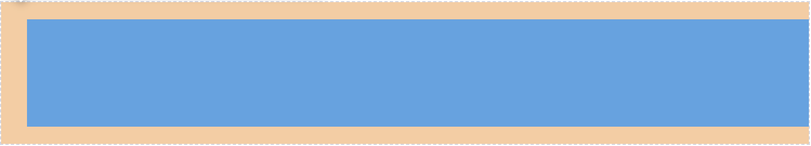

The CSS classes used for this are `lumx-spacing-margin-vertical-big` (which provides 8px of margin to top and bottom) and `lumx-spacing-margin-left-huge` (which provides 18px of margin to the left)

The same thing can be done to specify a padding for a component. For example, this component adds a padding of 24px to the component.

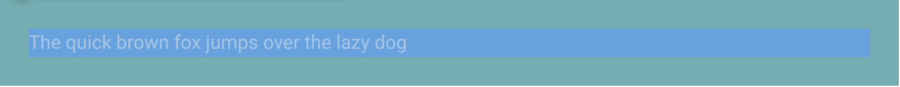

The CSS class used for this is `lumx-spacing-padding-huge`.

Sizes range from `tiny` to `huge`, where `tiny` is `4px`, `regular` is `8px`, `big` is `16px` and `huge` is `24px`.

#### Typography

There are also several CSS classes that can be used to specify the size of the text to be displayed.

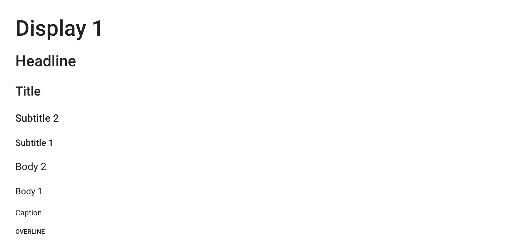

```html
<p class="lumx-typography-display1">Display 1</p>
<p class="lumx-typography-headline">Headline</p>
<p class="lumx-typography-title">Title</p>
<p class="lumx-typography-subtitle2">Subtitle 2</p>
<p class="lumx-typography-subtitle1">Subtitle 1</p>
<p class="lumx-typography-body2">Body 2</p>
<p class="lumx-typography-body1">Body 1</p>
<p class="lumx-typography-caption">Caption</p>
<p class="lumx-typography-overline">Overline</p>
```

#### Maximum width

LumApps web application has a maximum width for the components displayed, which can be noticed on the top bar components such as the navigation. In order to reuse this logic, you can use the css class `customizations-wrapper` in your components, which will then force the width of your customization to the exact same width as the other components of the site, while considering the application's look and feel on smaller devices.

Without the class `customizations-wrapper`:

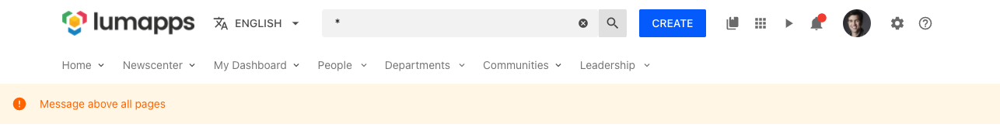

With the class `customizations-wrapper`:

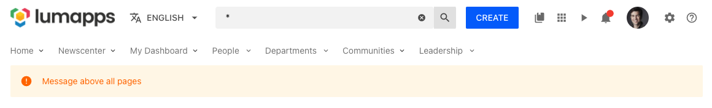


### Using icons

There are several components that have an option to configure a specific icon. On LumApps we use Material Design icons as the icons for our platform. The different icons that are available is quite extensive (around 4000+) and you can find icons and their IDs on the [Material Design site](https://materialdesignicons.com/). In order to retrieve the ID to be used on your customizations, you can go to the Material design site, click an icon and take a look at the details of the icon. A modal window will be displayed:

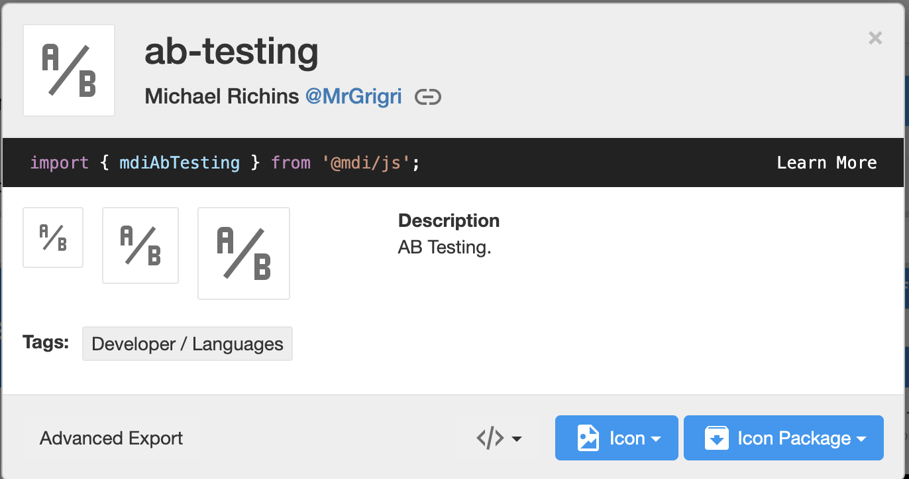

The ID is the modal's title. In the example, it is `ab-testing`.
