# Capabilities

## Rendering and replacing components

The Customizations API allows developers to render predefined components on several sections of their sites. The premise of this API is to create a set of components that can be easily used and composed, in order to render additional components to certains sections of the page, and make these types of customizations as easy as possible, while reusing LumApps code and components.

In order to understand the possibilities that we have with this API, we need to first define the different elements that compose a `Customization`. These components are:
- **Target**: This is the component of the page that we want to use as reference for our customization. This can be considered as the X coordinate for where to place our customization, and there is a predefined list of components that are marked as targets.

- **Placement**: This is where we are going to add our customization around that target. This can be considered as the Y coordinate for our customization, and the possible values for this placement depend on the component to be customized. This placement usually goes from above, under, to the left or to the right of the component, with some components having the possibility to be entirely replaced. It is also worth mentioning that not all targets are compatible with the full list of placements depicted here. More information on this on the [components](#components) section.

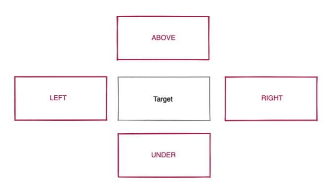

- **Component to render**: Basically this is what we want to render at the X and Y coordinates that we provided for target and placement.

As an example, inserting the following code in your LumApps site will display a message between the header and all pages:

```js
window.lumapps.customize(({ targets, components, render, session, placement, constants }) => {
    const { Message } = components; console.log(session);
    const { Kind } = constants;

    render({
        placement: placement.ABOVE,
        target: targets.PAGE,
        toRender: Message({
            className: 'general-message',
            kind: Kind.info,
            children: 'Message above all pages',
            hasBackground: true,
        }),
    });
});
```

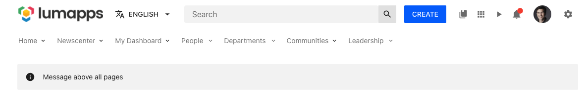

## Disabling components

This API allows disabling certain components, which will prevent them from displaying on the page, as well as avoiding any XHR requests or downloaded JS that may be related to the disabled component.

In some scenarios, disabling a component might need some extra CSS added to the page in order to adapt the customized UI to the expected outcome. In order scenarios, components can be disabled from a visual perspective, but XHR requests related to the component will still be executed. This is usually related to replacing a given component with a custom one, while reusing the data retrieved from the backend. More information on this on the [components](#components) section.

As an example, inserting the following code in your LumApps site will disable the Contribution button located on the top bar.

```js
window.lumapps.disable('contribution-button');
```

Before executing the code:


After executing the code:

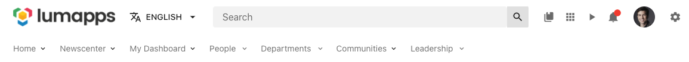


## Changing displayed text

In a specific set of components, developers have the possibility to change the main text displayed on a specific component.

For example, executing the following snippet will change the placeholder displayed on the Search box from `Search` to `Explore`, located at the top bar:

```js
window.lumapps.setText('search-box', {
    en: 'Explore',
    fr: 'Explorer',
    es: 'Explorar'
});
```

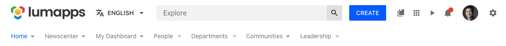


## Components

Here you will find the list of all the components that can be customized on LumApps, with the following information:
- Description of the component to customize, and the ID associated to it.
- Whether the component is compatible with the aforementioned features
- Possible use cases for the target.


### Application

Target that allows customizing the surroundings of your LumApps application.

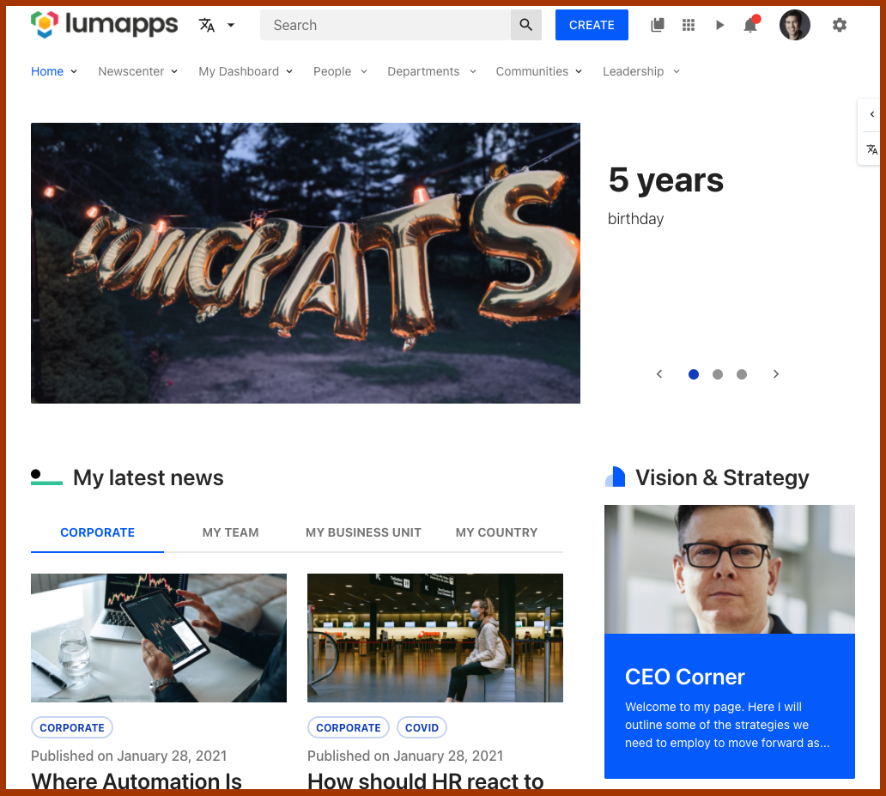

#### Compatibility

|               |                                                          |
|---------------|----------------------------------------------------------|
| Target ID     | `app`                                                    |
| Description   | Target that encapsulates the entire LumApps application. |
| Placements    | Compatible with placements: `ABOVE`, `RIGHT`, `LEFT` *   |
| Disable       | No compatibility                                         |
| Changing text | No compatibility                                         |

**Note:** Using the `RIGHT` and `LEFT` placements will make the custom component display at either the left top hand side or the right hand side of the application with a `position: absolute;` and either `right: 0;` or `left: 0;`. Furthermore, components will be added as siblings of the main content of the application

#### Use cases

- [Adding a side navigation to the application](./use-cases#adding-a-side-navigation-to-the-application)
- [Displaying a modal welcome window](./use-cases#displaying-a-modal-welcome-window)

### Bookmarks

Target that allows customizing the bookmarks (also known as [App launcher](https://docs.lumapps.com/docs/explore-l1119324950335211)) component

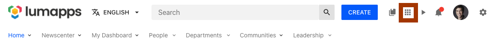

#### Compatibility

|               |                                                                                                 |
|---------------|-------------------------------------------------------------------------------------------------|
| Target ID     | `bookmarks`                                                                                     |
| Description   | Target that focuses on the bookmarks (app launcher) icon on the top bar of your site            |
| Placements    | No compatibility                                                                                |
| Disable       | Can be disabled. Disabling this component prevents the icon from being displayed on the top bar |
| Changing text | No compatibility                                                                                |

#### Use cases

- [Hide app launcher](./use-cases#hide-app-launcher)

### Community

Target that allows customizing the surroundings of a [community](https://docs.lumapps.com/docs/explore-l8416655995933057communities) page.

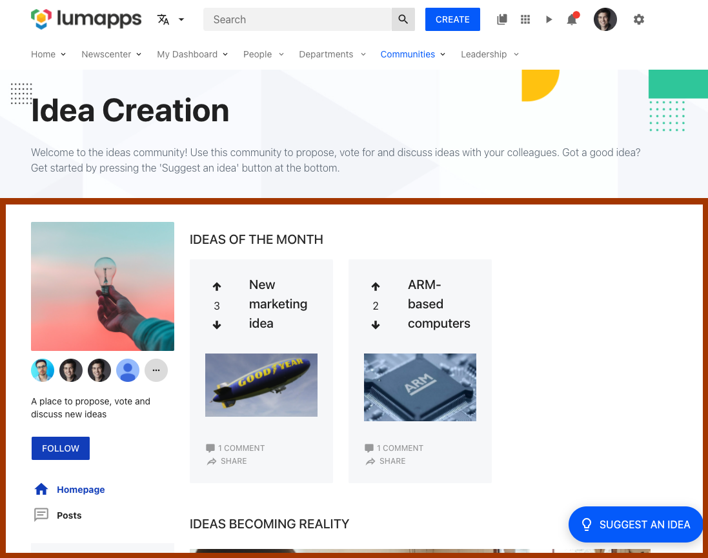

#### Compatibility

|               |                                                                                                                                                                      |
|---------------|----------------------------------------------------------------------------------------------------------------------------------------------------------------------|
| Target ID     | `community`                                                                                                                                                          |
| Description   | Target that focuses on the Community page. Adding a customization to this target would mean that ALL communities will display it.                                    |
| Placements    | Compatible with placements: `ABOVE`, `UNDER`. For `ABOVE`, the customization will appear between the header of the application and the main section of the community |
| Disable       | No compatibility                                                                                                                                                     |
| Changing text | No compatibility                                                                                                                                                     |


#### Use cases

- [Display a message above all pages of a certain type](./use-cases#display-a-message-above-all-pages-of-a-certain-type)

### Content

Target that allows customizing the surroundings of a [Content](https://docs.lumapps.com/docs/docs/explore-landing/explore-l9221992253753845content) page.

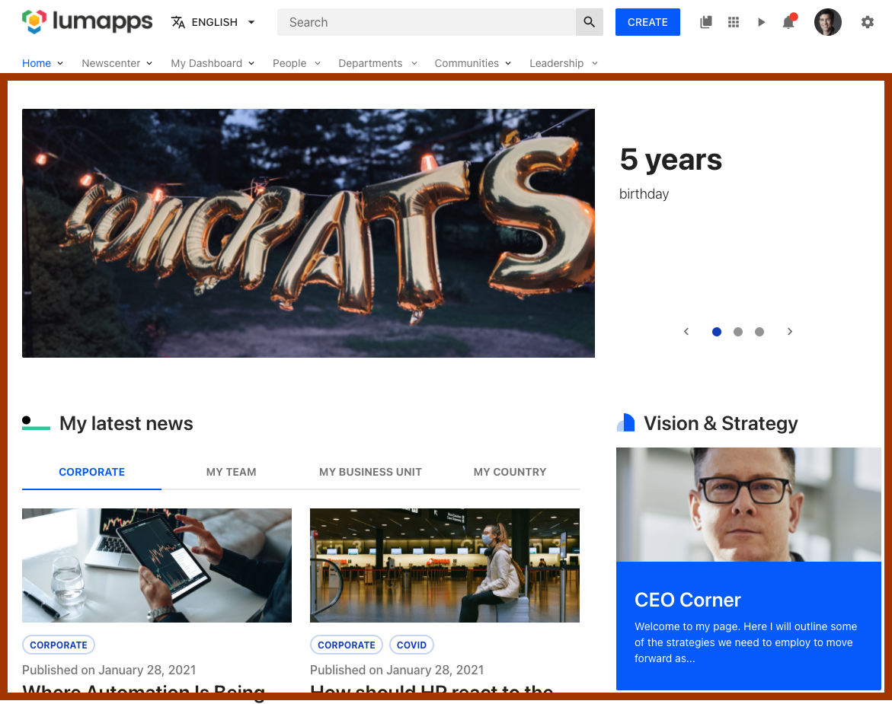

#### Compatibility

|               |                                                                                                                                                                    |
|---------------|--------------------------------------------------------------------------------------------------------------------------------------------------------------------|
| Target ID     | `content`                                                                                                                                                          |
| Description   | Target that focuses on the Content page. Adding a customization to this target would mean that ALL contents will display it.                                       |
| Placements    | Compatible with placements: `ABOVE`, `UNDER`. For `ABOVE`, the customization will appear between the header of the application and the main section of the content |
| Disable       | No compatibility                                                                                                                                                   |
| Changing text | No compatibility                                                                                                                                                   |

#### Use cases

- [Display a message above all pages of a certain type](./use-cases#display-a-message-above-all-pages-of-a-certain-type)

### Contextual actions

Target that allows customizing the surroundings of the [contextual actions](https://docs.lumapps.com/docs/explore-l8446217831749085content) displayed on content pages.

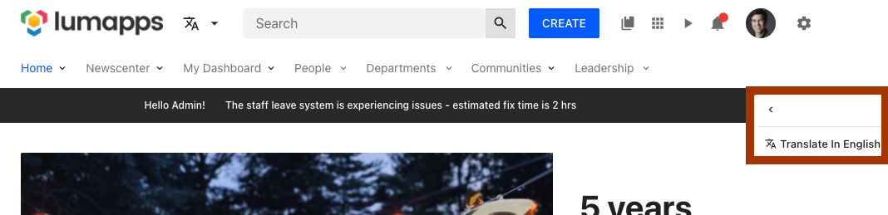

#### Compatibility

|               |                                                                                                                      |
|---------------|----------------------------------------------------------------------------------------------------------------------|
| Target ID     | `contextual-actions`                                                                                                 |
| Description   | Target that focuses on the Contextual actions, adding new custom actions.                                            |
| Placements    | Compatible with placements: `ABOVE`, `UNDER`. Custom actions will be added as siblings of the out-of-the-box-actions |
| Disable       | No compatibility                                                                                                     |
| Changing text | No compatibility                                                                                                     |

#### Use cases

- [Create a Copy Link to Content action](./use-cases#create-a-copy-link-to-content-action)

### Contribution button

Target that allows customizing the [contribution button](https://docs.lumapps.com/docs/docs/explore-landing/explore-l34558858053534214/explore-l3451406716743173#l34173657923168954) located on the top bar of your site.

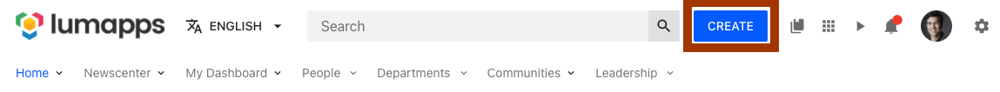

#### Compatibility

|               |                                                                                                               |
| ------------- | ------------------------------------------------------------------------------------------------------------- |
| Target ID     | `contribution-button`                                                                                         |
| Description   | Target that focuses on the Contribution button on the top bar.                                                |
| Placements    | Compatible with placements: `LEFT`, `RIGHT`. Customizations are added as siblings of the contribution button. |
| Disable       | Can be disabled. Disabling this feature will make the button hidden for all users                             |
| Changing text | No compatibility                                                                                              |

#### Use cases

- [Adding new actions on the top bar](#adding-new-actions-on-the-top-bar)

### Contribution menu

Target that allows customizing the [contribution menu](https://docs.lumapps.com/docs/docs/explore-landing/explore-l34558858053534214/explore-l3451406716743173#l34173657923168954) displayed once the contribution button has been clicked.

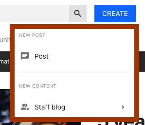

#### Compatibility

|               |                                                                                                                     |
| ------------- | ------------------------------------------------------------------------------------------------------------------- |
| Target ID     | `contribution-menu`                                                                                                 |
| Description   | Target that focuses on the Contribution Menu displayed from the contribution button.                                |
| Placements    | Compatible with placements: `ABOVE`, `UNDER`. Customizations are added as siblings of the other actions in the menu |
| Disable       | No compatibility                                                                                                    |
| Changing text | No compatibility                                                                                                    |

#### Use cases

- [Adding links to the contribution menu](./use-cases#adding-links-to-the-contribution-menu)

### Favorites

Target that allows customizing the [favorites directories](https://docs.lumapps.com/docs/explore-l8658525737805197modules) displayed on the top bar.


#### Compatibility

|               |                                                                                               |
|---------------|-----------------------------------------------------------------------------------------------|
| Target ID     | `favorites`                                                                                   |
| Description   | Target for the favorites directories displayed at the top bar.                                |
| Placements    | No compatibility                                                                              |
| Disable       | Can be disabled. Disabling this features hides ALL directories flagged as "Manage favorites". |
| Changing text | No compatibility                                                                              |

### Header

Target that allows customizing the entire header of the application, which englobes the top bar (logo, search box, notifications), the navigation of the site as well as the site's [slideshow](https://docs.lumapps.com/docs/explore-l0285322674420444).

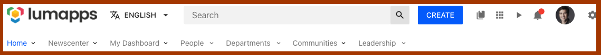

#### Compatibility

|               |                                                                                                     |
| ------------- | --------------------------------------------------------------------------------------------------- |
| Target ID     | `header`                                                                                            |
| Description   | Target for the header of your site.                                                                 |
| Placements    | No compatibility                                                                                    |
| Disable       | No compatibility                                                                                    |
| Changing text | No compatibility                                                                                    |

### Logo

Target that allows customizing the surroundings of the site's [logo](https://docs.lumapps.com/docs/explore-l08263938963294604/explore-l10172021770563788).

#### Compatibility

|               |                                                                                                     |
| ------------- | --------------------------------------------------------------------------------------------------- |
| Target ID     | `logo`                                                                                              |
| Description   | Target for the logo of your site.                                                                   |
| Placements    | Compatible with placements: `LEFT`, `RIGHT`. Customizations will be added as siblings of the Logo   |
| Disable       | No compatibility                                                                                    |
| Changing text | No compatibility                                                                                    |

#### Use cases

- [Add an additional logo or badge depending on the current user](./use-cases#add-an-additional-logo-or-badge-depending-on-the-current-user)
- [Adding new actions on the top bar](./use-cases#adding-new-actions-on-the-top-bar)

### Navigation

Target that allows customizing the [main navigation](https://docs.lumapps.com/docs/explore-l1545732099868311) of your site, which is the first navigation displayed on your top bar.

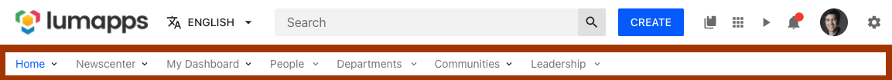

#### Compatibility

There are two targets that focus on the main navigation, each of them have a different end result.

|               |                                                                                                                                |
|---------------|--------------------------------------------------------------------------------------------------------------------------------|
| Target ID     | `navigation`                                                                                                                   |
| Description   | Target for the entire main navigation feature of your site.                                                                    |
| Placements    | Compatible with placements: `LEFT`, `RIGHT`. Customizations will be added as siblings of the other navigation items displayed. |
| Disable       | Can be disabled**.                                                                                                             |
| Changing text | No compatibility                                                                                                               |

**Note:**: Disabling this feature prevents the navigation from being displayed on the site, removing the entire section from your page and avoiding any XHR requests to retrieve the data. Some additional CSS is needed in order to make this customization work as expected

|               |                                                   |
|---------------|---------------------------------------------------|
| Target ID     | `navigation-ui`                                   |
| Description   | Target for your site's main navigation interface. |
| Placements    | No compatibility                                  |
| Disable       | Can be disabled**                                 |
| Changing text | No compatibility                                  |

**Note:** Disabling this feature prevents the navigation from being displayed on the site, removing the entire section from your page, BUT the navigation is still fetched so it can be reused for rendering a custom navigation. Some additional CSS is needed in order to make this customization work as expected

#### Use cases

- [Hide the entire navigation on your site](./use-cases#hide-the-entire-navigation-on-your-site)
- [Create a custom navigation for your site](./use-cases#create-a-custom-navigation-for-your-site)

### Notifications button

Targets that allows customizing the [notifications center button](https://docs.lumapps.com/docs/docs/explore-landing/explore-l03614667337598343notifications/explore-l056033737398520134notifications)

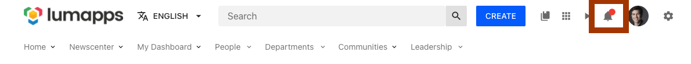

#### Compatibility

|               |                                                                                                                     |
| ------------- | ------------------------------------------------------------------------------------------------------------------- |
| Target ID     | `notifications-button`                                                                                              |
| Description   | Target for the notifications button located on the top bar.                                                         |
| Placements    | Compatible with placements: `LEFT`, `RIGHT`. Customizations will be added as siblings of the notifications button   |
| Disable       | No compatibility                                                                                                    |
| Changing text | No compatibility                                                                                                    |

#### Use cases

- [Adding new actions on the top bar](./use-cases#adding-new-actions-on-the-top-bar)

### Page

Target that allows customizing pages on your site. This specific target allows developers to display a customization on all pages no matter whether they are the search page, the user profile page or more dynamic pages like content pages and community pages.

#### Compatibility

|               |                                                                                                              |
|---------------|--------------------------------------------------------------------------------------------------------------|
| Target ID     | `page`                                                                                                       |
| Description   | Target all pages of your site.                                                                               |
| Placements    | Compatible with placements: `ABOVE`, `UNDER`. Customizations will be added as siblings of the current page*. |
| Disable       | No compatibility                                                                                             |
| Changing text | No compatibility                                                                                             |

**Note:** If there is another customization in place that targets more specific targets like [Content](#content) or [Community](#community), the page customization is displayed above and below these customizations.

#### Use cases

- [Display a message across your entire site](./use-cases#display-a-message-accross-your-entire-site)
- [Display a message above all pages of a certain type](./use-cases#display-a-message-above-all-pages-of-a-certain-type)

### User profile

Target that allows customizing the [user profile page](https://docs.lumapps.com/docs/users-l24200460242637034).

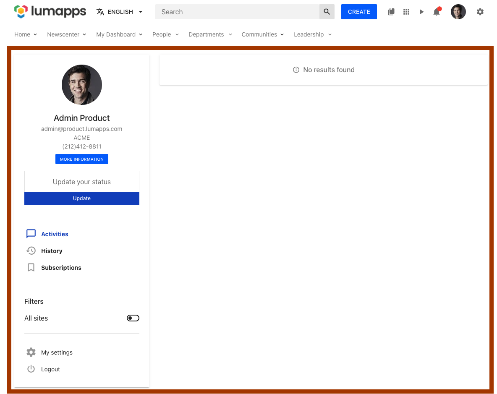

#### Compatibility

|               |                                                                                                                  |
|---------------|------------------------------------------------------------------------------------------------------------------|
| Target ID     | `profile`                                                                                                        |
| Description   | Target the user profile page.                                                                                    |
| Placements    | Compatible with placements: `ABOVE`, `UNDER`. Customizations will be added as siblings of the user profile page. |
| Disable       | No compatibility                                                                                                 |
| Changing text | No compatibility                                                                                                 |

#### Use cases

- [Display a message above all pages of a certain type](./use-cases#display-a-message-above-all-pages-of-a-certain-type)

### Organization chart

Target that allows customizing the user organization chart.

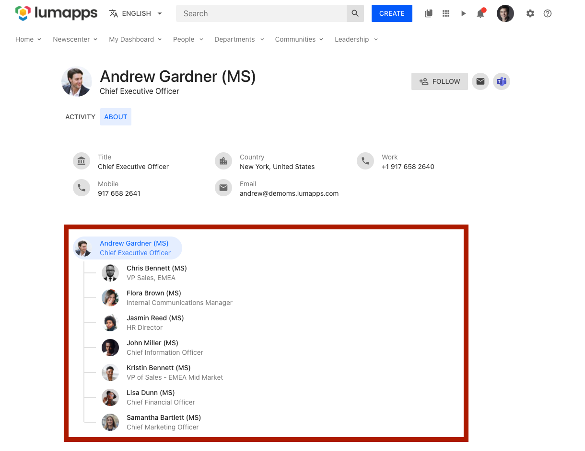

#### Compatibility

|               |                                                                                                                  |
|---------------|------------------------------------------------------------------------------------------------------------------|
| Target ID     | `user-profile-org-chart`                                                                                                        |
| Description   | Target the organization chart section of a user's profile.                                                                                    |
| Placements    | Compatible with placements: `ABOVE`, `UNDER`. Customizations will be added as siblings of the displayed user's organization chart. |
| Disable       | No compatibility                                                                                                 |
| Changing text | No compatibility                                                                                                 |

**Notes:**
* The `User space` feature flag must be enabled in order to access the new user profile experience.
* The displayed user's data can be retrieved using [context](./api#organization-chart-context).

### Search

Target that allows customizing the [search page](https://docs.lumapps.com/docs/explore-l045373566110773145search/explore-l044925657249748285search).

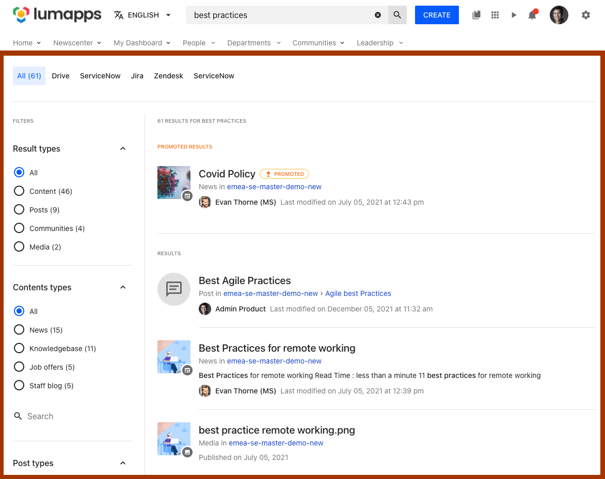

#### Compatibility

|               |                                                                                                              |
| ------------- | -------------------------------------------------------------------------------------------------------------|
| Target ID     | `search`                                                                                                     |
| Description   | Target the search page.                                                                                      |
| Placements    | Compatible with placements: `ABOVE`, `UNDER`. Customizations will be added as siblings of the search page.   |
| Disable       | No compatibility                                                                                             |
| Changing text | No compatibility                                                                                             |

#### Use cases

- [Display a message above all pages of a certain type](./use-cases#display-a-message-above-all-pages-of-a-certain-type)

### Search box

Target that allows customizing the [search box](https://docs.lumapps.com/docs/explore-l045373566110773145search/explore-l044925657249748285search) located at the top bar.

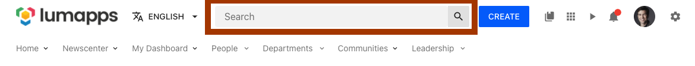

#### Compatibility

|               |                                                                                                                         |
| ------------- | ------------------------------------------------------------------------------------------------------------------------|
| Target ID     | `search-box`                                                                                                            |
| Description   | Target the search box at the top bar.                                                                                   |
| Placements    | Compatible with placements: `LEFT`, `RIGHT`. Customizations will be added as siblings of the search box.                |
| Disable       | Can be disabled. Disabling this component hides the search box and all features related to search.                      |
| Changing text | Can be changed. The text displayed on the search box placeholder can be changed by using the change text functionality. |

#### Use cases

- [Disable the search box](./use-cases#disable-the-search-box)
- [Adding new actions on the top bar](./use-cases#adding-new-actions-on-the-top-bar)

### Search custom metadata

Target that allows customizing the search custom metadata.

#### Compatibility

|               |                                    |
| ------------- | -----------------------------------|
| Target ID     | `search-custom-metadata`           |
| Description   | Target the search custom metadata. |
| Placements    | No compatibility                   |
| Disable       | No compatibility.                  |
| Changing text | No compatibility.                  |

#### Use cases

### Settings button

Target that allows customizing the settings icon displayed on the top bar.

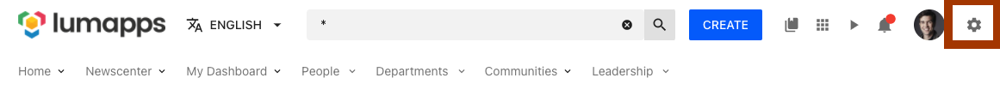

#### Compatibility

|               |                                                                                                              |
| ------------- | -------------------------------------------------------------------------------------------------------------|
| Target ID     | `settings-button`                                                                                            |
| Description   | Target the settings icon on the top bar.                                                                     |
| Placements    | Compatible with placements: `LEFT`, `RIGHT`. Customizations will be added as siblings of the settings icon.  |
| Disable       | No compatibility                                                                                             |
| Changing text | No compatibility                                                                                             |

#### Use cases

- [Adding new actions on the top bar](./use-cases#adding-new-actions-on-the-top-bar)

### Settings dropdown

Target that allows customizing the settings links displayed on the dropdown triggered by the settings button.

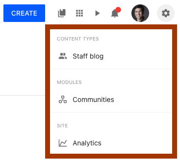

#### Compatibility

|               |                                                                                                                  |
|---------------|------------------------------------------------------------------------------------------------------------------|
| Target ID     | `profile`                                                                                                        |
| Description   | Target the user profile page.                                                                                    |
| Placements    | Compatible with placements: `ABOVE`, `UNDER`. Customizations will be added as siblings of the user profile page. |
| Disable       | No compatibility                                                                                                 |
| Changing text | No compatibility                                                                                                 |


**Note:** Customizations added to this target will only be visible to those users that have access to one of the multiple settings displayed on the dropdown. If a user does not have access to this icon, the customizations will not be displayed

#### Use cases

- [Add links to other administration tools](./use-cases#add-links-to-other-administration-tools)

### Sticky header

Target that allows deactivating that your site's header has a sticky behaviour, meaning that it will stick to the top of your page while the user is scrolling.

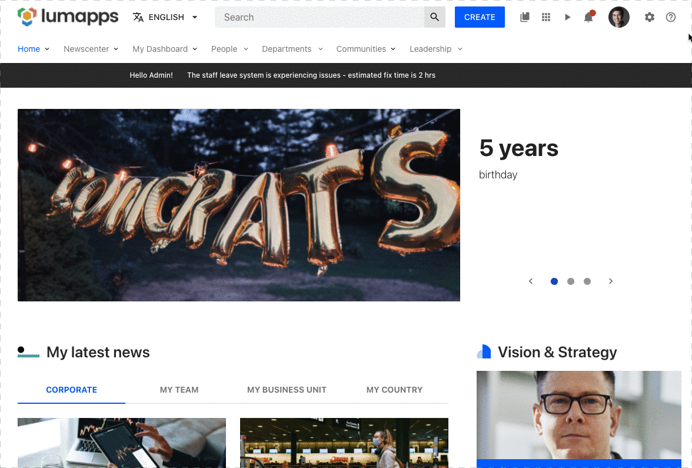

#### Compatibility

|               |                                                  |
|---------------|--------------------------------------------------|
| Target ID     | `sticky-header`                                  |
| Description   | Target that allows disabling the sticky header * |
| Placements    | No compatibility                                 |
| Disable       | No compatibility                                 |
| Changing text | No compatibility                                 |

**Note**: some extra CSS needs to be added in order to make this customization have the expected result

#### Use cases

- [Disable the sticky header](./use-cases#disable-the-sticky-header)

### Navigation

Target that allows customizing the [sub navigation](https://docs.lumapps.com/docs/explore-l0914183586055497inheritance) of your site, which is the second navigation displayed on your top bar when your site has a parent site and the navigation inheritance feature is activated


#### Compatibility

There are two targets that focus on the sub navigation, each of them have a different end result.

|               |                                                                                                                                |
|---------------|--------------------------------------------------------------------------------------------------------------------------------|
| Target ID     | `sub-navigation`                                                                                                               |
| Description   | Target for the entire sub navigation feature of your site *.                                                                   |
| Placements    | Compatible with placements: `LEFT`, `RIGHT`. Customizations will be added as siblings of the other navigation items displayed. |
| Disable       | Can be disabled.                                                                                                               |
| Changing text | No compatibility                                                                                                               |

**Note:** Disabling this feature prevents the navigation from being displayed on the site, removing the entire section from your page and avoiding any XHR requests to retrieve the data. Some additional CSS is needed in order to make this customization work as expected

|               |                                                  |
|---------------|--------------------------------------------------|
| Target ID     | `sub-navigation-ui`                              |
| Description   | Target for your site's sub navigation interface. |
| Placements    | No compatibility                                 |
| Disable       | Can be disabled. *                               |
| Changing text | No compatibility                                 |

**Note:** Disabling this feature prevents the navigation from being displayed on the site, removing the entire section from your page, BUT the navigation is still fetched so it can be reused for rendering a custom navigation. Some additional CSS is needed in order to make this customization work as expected

#### Use cases

- [Hide the entire navigation on your site](./use-cases#hide-the-entire-navigation-on-your-site)
- [Create a custom navigation for your site](./use-cases#create-a-custom-navigation-for-your-site)

### Widget

Dynamic target that allows customizing the surroundings of a [widget](https://docs.lumapps.com/docs/explore-l8845750598632305)

**IMPORTANT:**
- This is only compatible with pages rendered in the Next Gen Interface.
- This target should only be used for customizing an existing widget. For creating new custom widgets, please create an [extension](../../extensions/index.md)

#### Compatibility

|               |                                                                       |
|---------------|-----------------------------------------------------------------------|
| Target ID     | `widget-{<id>}` *                                                     |
| Description   | Dynamic target that allows customizing the surroundings of a [widget] |
| Placements    | Compatible with placements: `ABOVE`, `UNDER` **                       |
| Disable       | No compatibility                                                      |
| Changing text | No compatibility                                                      |

**Notes:**
- `id` can be retrieved by inspecting the HTML of your content and retrieving the id. Without the `id`, the target will be considered as invalid
- Additional CSS might be needed, depending on the nature of your customization and the layout of your content page

#### Use cases

- [Adding a customization to a widget](./use-cases#adding-a-customization-to-a-widget)
