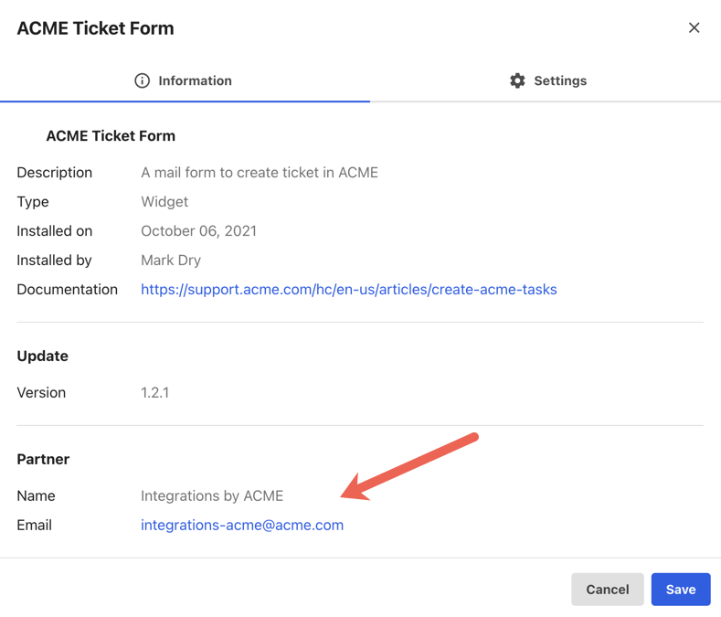
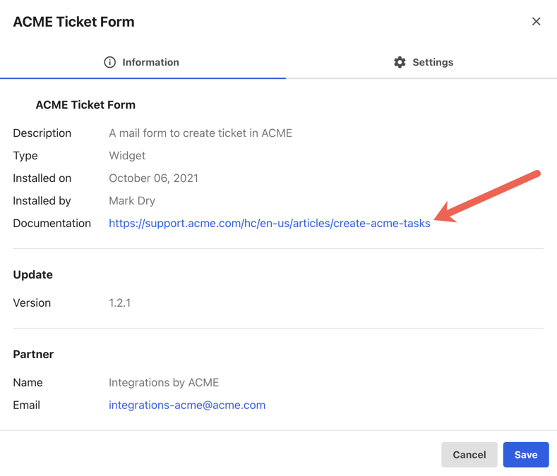

# Developing extensions

<h6>Table of Contents</h6>

- [Extension manifest](#extension-manifest)
  - [Manifest attributes](#manifest-attributes)
    - [Links](#links)
    - [Availability](#availability)
    - [PartnerId & ExtensionId](#partnerid--extensionid)
    - [Components](#components)
    - [Application](#application)
    - [Public](#public)
    - [Whitelist](#whitelist)
    - [Category](#category)
- [Extension dependencies](#extension-dependencies)
  - [Add new dependencies](#add-new-dependencies)
    - [Dynamic import](#dynamic-import)
- [Using OAuth application](#using-oauth-application)
  - [Configure extension](#configure-extension)
  - [Received selected application](#received-selected-application)

An extension project is a combination of an extension manifest (metadata) and extension code. This part of the documentation details our manifest and the dependencies.

## Extension manifest

The Extension Manifest is the file used by the LumApps Marketplace to identify your extension and know what your extension does.

You need to fill in the extension manifest to declare your extension in the LumApps Marketplace. This file is attached to the extension and is already pre-configured when you create an extension using a LumApps extension template.

### Manifest attributes

In this configuration file, you have to define the following properties:

| Attribute        | Mandatory | Type                | Description                                                             |
| :--------------- | :------- | :------------------ | :------------------------------------------------------------------------------------- |
| **partnerId**    | yes      | string              | The id of your partner organization.                                                   |
| **extensionId**  | yes      | string              | The id of your extension.                                                              |
| **description**  | yes      | Translatable string | The description of the extension in multiple language.                                 |
| **name**         | yes      | Translatable string | The name of the extension in multiple language.                                        |
| **icon**         | yes      | Translatable string | The public link to the icon of the extension in multiple language.                     |
| **application**  | no       | JSON Object         | Indicates if the extension need to connect to an external service (from LumApps side). |
| **availability** | yes      | string              | The availability of the extension.                                                     |
| **links**        | no       | JSON Object         | The useful HTTP links related to the extension.                                        |
| **components**   | yes      | Array of components | Array of the components that compose your extension.                                   |
| **public**       | yes      | boolean             | Whether the extension is public or private.                                            |
| **whitelist**    | no       | Array of string OR JSON Object | The list of whitelisted customer IDs. Used only if your extension is not public.|
| **category**     | yes      | string              | The category of your extension.                                                        |

Some properties are simple to define such as name, description, or icon. Other properties might be harder to define. Here is a quick description on how to retrieve the wanted data:

#### PartnerId

The partner ID is sent to you via email when you register your partner organization. Only users with a valid LumApps JWT token can query marketplace services. The same ID is used for all your extensions. You also have to set your Partner ID in the manifest file.

Your parnter organization information are displayed in the installed extension administration in the customer platform.



#### ExtensionId

To claim the extension ID, we use data defined in the manifest file to generate the ID. Like the partner ID, this ID has to be set in the extension manifest file.

#### Application

The application attribute is used to indicate your extension needs to contact an external service through an authorization protocol (OAuth v2 or Application token).
To determine which provider you want to connect to your extension, you have to set the provider type in the application object:

```json
application: {
	providerType: 'microsoft'
}
```

The provider type can be retrieved from the provider list by contacting the following endpoint
`https://go-shared-services.api.lumapps.com/v2/providers`.

If your provider is not present in the list, you can request a provider creation by sending us the following information:

-   Provider name
-   Provider icon
-   Provider type

#### Availability

Define the availability of the extension. Two types are available:

-   `marketplace` (default) : The customer needs to have the marketplace activated on their environment.
-   `open` : The extension is available for everyone.

>**Note:** If your extension is set as `marketplace`, a customer without the marketplace activated will never be able to see the extension, even if you whitelist it.

#### Links

This property lets the developer define useful links for the extension.
For now, we only manage documentation links and must be defined as a sub property of links attribute:

```json
links: {
	documentation: ‘https//….’
}
```

This link is displayed in the installed extension administration in the customer platform.



#### Components

The components attribute is the array of React components type that compose the extension. The components depend on the category of your extension.

For Widget Extensions, the available values are:

-   **content** (mandatory) - For widget content components.
-   **settings** (optional) - For widget settings component (display when user adds a widget in a piece of content).
-   **global_settings** (optional) - Global settings of the extension (displayed in extension administration).

For Share To Extensions, the available values are:

-   **content** (mandatory) - For Share To dialog content.
-   **global_settings** (optional) - Global settings of the extension (displayed in extension administration).

#### Public

The public attribute is used to define if the extension is available for all LumApps customers with the marketplace feature enabled. If a partner does not want to publish an extension for all LumApps customers, they can set their extension to private (non-public).

#### Whitelist

The whitelist is used only for private extensions. You have to define a list of authorized customer IDs for your extension.
The customer ID is available in the customer platform by pressing on `CTRL + ?`. The customer ID is displayed in the dialog.

If a customer has multiple platforms in different environments (Production and Staging for example), they also have a different customer ID for each environment. That means each customer ID has to be whitelisted to publish the extension in every environment for this customer.

```json
# Simple whitelist (for production environment)
whitelist: ['987654321'],
# With different environment
whitelist : {
    staging: [
        '123456789',
    ],
    production: [
        '987654321'
    ]
}
```

### Category

The category attribute is used to define the kind of extension. It can be **widget**, **backend** or **share_to**.

## Extension dependencies

For your frontend extensions, you need to add dependencies. As your extension are loaded by the LumApps platform, you cannot use any libraries you want, but we provide a list of authorized libraries for your extension:

| library                                                        | version    | description            |
| :------------------------------------------------------------- | :--------- | :--------------------- |
| [axios](https://github.com/axios/axios)                        | "^0.21.1"  |                        |
| [lodash](https://github.com/lodash/lodash)                     | "4.17.21"  |                        |
| [lumapps-sdk-js](https://www.npmjs.com/package/lumapps-sdk-js) | "latest"   | LumApps JavaScript SDK |
| [lumX](https://github.com/lumapps/design-system)               | "latest"   | LumApps Design System  |
| [moment](https://github.com/moment/moment)                     | "^2.29.1"  |                        |
| [moment-range](https://github.com/rotaready/moment-range)      | "^4.0.2"   |                        |
| [react](https://github.com/facebook/react)                     | "^16.13.1" |                        |

### Add new dependencies

You can import any dependency into your extension, but they can increase drastically the size of your bundle. To prevent this and create a better user experience, you should consider using dynamic import when you can.

> **Note**: LumApps does not support dependencies with a global impact.

#### Dynamic import

Dynamic import lets you make import asynchronously. In some cases, it can be very useful to load a dependency only when needed.

Example:

In this example, we import two elements from `my-library`.

Imports are only made when the `loadLibrary` function is called.

We can use webpack magic comments to optimize even more the build by telling webpack that we only need specific elements from the library :

`/* webpackExports: ["import1", "import2", ...] */`

Remember: Imports are made asynchronously, so you need to check that they are loaded before using them

```tsx
const Widget = (): React.ReactElement => {
   const [myLibrary, setMyLibrary] = useState < any > null;

   const loadLibrary = async () => {
      const { exempleImportedConst, exempleImportedFunction } = await import(
         /* webpackExports: ["exempleImportedConst", "exempleImportedFunction"] */ "my-library"
      );
      setMyLibrary({ exempleImportedConst, exempleImportedFunction });
   };

   return (
      <>
         <button onClick={loadLibrary}>Click me</button>
         {myLibrary && (
            <>
               <p>Display : {myLibrary.exempleImportedConst}</p>
               <p>Execute : {myLibrary.exempleImportedFunction()}</p>
            </>
         )}
      </>
   );
};

export default Widget;
```

## Using OAuth application

From your extension, you can use the OAuth protocol to contact an application server.

### Configure extension

If your extension needs to use an OAuth application, you have to set it up in the manifest file. Then the user who installs the app can define which application (declared on their platform) they want to use.

### Receive selected application

In your content & your Settings components, you will be able to retrieve the application set by the customer administrator via props sent by LumApps to your extension.

You will receive the OAuth application ID inside the `globalValue` property:

```javascript
interface WidgetProps {
    globalValue?: {
        oauthApplicationId: string
    };
    ...
}
```
