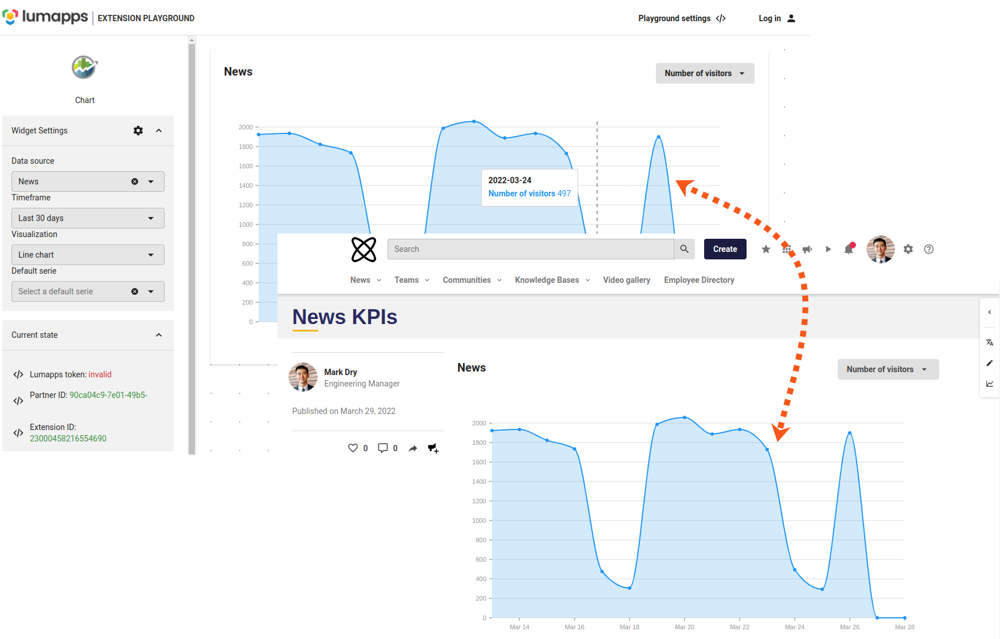

# Create your extension

This section details the lifecycle of the extension in order to have it available on your platform.

-   [Prerequisites and guidelines](/prerequisites.md) describes what you need to know before you start  building your extension.
-   [Extension development](/develop-extensions.md) contains the dependencies and configuration information for the extension.
-   [Extension creation](/build-extensions.md) explains how to build the extension using the playground.
-   [Extension tests](/extensions-test.md) explains how to test your extension locally and on your test platform.
-   [Submission](/submit-extension.md) explains how to ask for review and deployment.
-   [Extension management](/manage-extensions.md) explains how to update extension information and configuration.

Below, you can see an example of an extension widget made for analytics on the playground and inside a piece of content.

