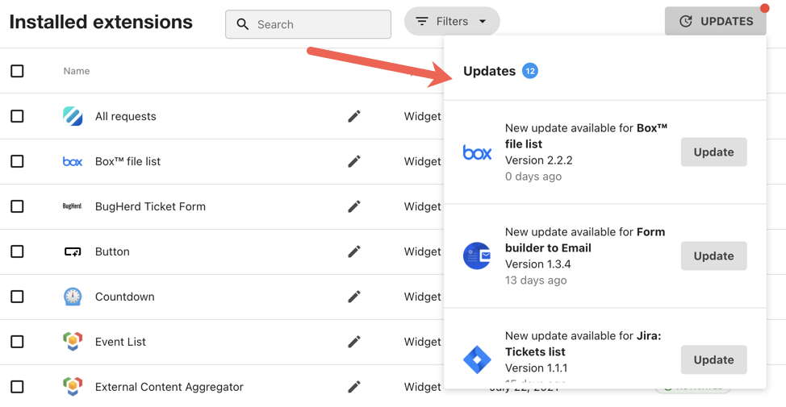

# Submit your extension

Once your local and LumApps tests are done, you can submit the version of your extension for review. While in review, all test accounts can continue to test the extension. The submission is done via a GitHub pull request with the code you want to submit.

To ease the review, you have to open a specific PR for each deployment request with the code you want to deploy.

<h6>Table of Contents</h6>

-   [Submit your extension](#submit-your-extension)
-   [Pull Request labels](#pull-request-labels)
-   [Approval and rejection](#approval-and-rejection)
-   [Extension deployment](#extension-deployment)
-   [Multiple versions](#multiple-versions)

## Submit your extension

The extension submission is done from the developer portal.

### Approval and rejection

After an extension version is reviewed by LumApps, there are two possible outcomes:

-   **Approved** means your extension respects our guidelines and you are allowed to deploy it.
-   **Rejected** means that your extension may not respect our guidelines and some revisions are required. We will provide the reason. You can edit your extension, test it again, and resubmit your extension when you are ready.

## Extension deployment

Once your source code has been reviewed and validated, your extension can be deployed in production. This is done from the developer portal.

> **Note:**: If you want to edit your extension after its validation, you have to resubmit this new version and ask for a new review.

### Multiple versions

LumApps authorize multiple versions of your extension in production at the same time. If the version is a patch or a minor update, the update is pushed automatically. If the version is a major update, users must manually update the extension inside their administration panel.

Be sure to provide enough information to users if some actions need to be performed to upgrade to a new version.
