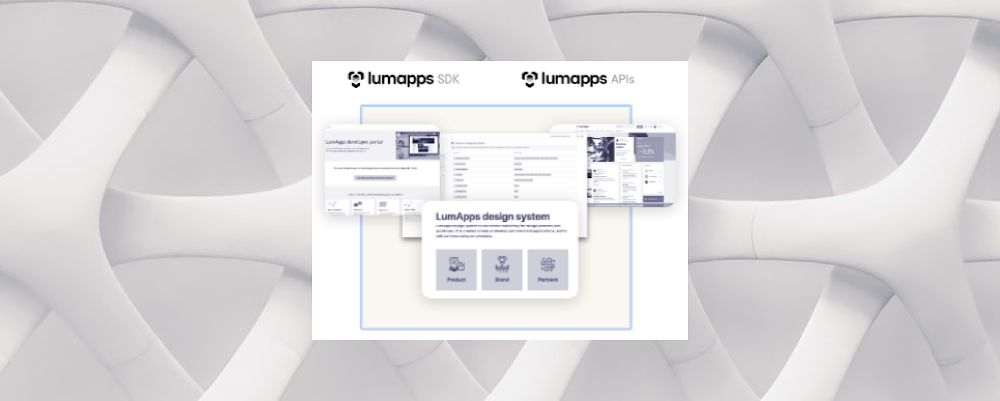

# Get started with building LumApps extensions

<h6>Table of Contents</h6>

- [Get started with building LumApps extensions](#get-started-with-building-lumapps-extensions)
  - [Quickly develop your own extensions](#quickly-develop-your-own-extensions)
  - [Tailor your LumApps experience to your own needs](#tailor-your-lumapps-experience-to-your-own-needs)

## Quickly develop your own extensions
LumApps offers an extensive, user-friendly, and secure toolset to customers, and integration and technology partners. With the help of this toolset, you can quickly link a platform to third-party apps in a number of ways to boost productivity and employee services.
 

## Tailor your LumApps experience to your own needs
Because every company is different, the LumApps off-the-shelf integrations might not satisfy all of your requirements. The LumApps marketplace program exists to assist you in creating and designing custom integrations within a constrained time and budget. 

LumApps offers a dedicated environment for your IT department or partners to create "connecting links" to your preferred employee services or business apps. All of your extensions will blend perfectly with the rest of you platform's design and aesthetic thanks to our toolset.