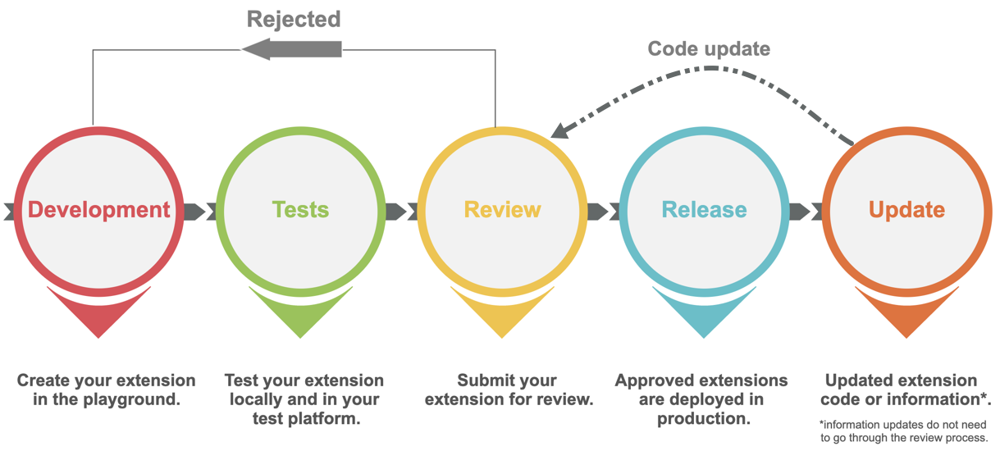

# Get started with building LumApps extensions

<h6>Table of Contents</h6>

- [Get started with building LumApps extensions](#get-started-with-building-lumapps-extensions)
  - [Terminology](#terminology)
  - [Marketplace](#marketplace)
  - [Type of extensions](#type-of-extensions)
  - [Lifecycle of an extension](#lifecycle-of-an-extension)

## Terminology

-   **Marketplace**: The marketplace is a place where you can install extensions built either by LumApps or by partner organizations.
-   **Extension**: An extension is a program which offers additional capabilities to your platform. Extensions can be public or private.
-   **Playground**: The playground is the place where you can build and preview extensions.
-   **Partner Organization**: A partner organization is a contributor to the Marketplace. If you are building extensions, you are a partner organization.
-   **Test platform**: The test platform is a platform parallel to your production platform on which you can test your extensions.

## Marketplace

The LumApps Marketplace is a hub where you can install and configure extensions. LumApps builds some extensions, but extensions can also be built by a partner organization - you.  An extension is a small program or application that sits inside LumApps and communicates with LumApps and/or an external service to extends LumApps capabilities. For example, the countdown widget extension lets users use a new widget in their piece of content to display a countdown, and the Zoom widget lets users connect to a townhall meeting directly from a piece of content.

## Type of extensions

LumApps extensions let you interact with the LumApps platform to extend its capabilities. You can extend the LumApps platform in three different ways:

| Extension type | Capabilities                                                                                                     |
| -------------- | ---------------------------------------------------------------------------------------------------------------- |
| **Backend**    | Extends LumApps without any user interface. It can be a script that consumes LumApps API.                        |
| **Share To**   | Extends the share capabilities in LumApps.                                                                       |
| **Widget**     | Provides new widgets to LumApps users. Widgets are UI components in a page used to display information to users. |

## Lifecycle of an extension

An extension goes through different stages before it is deployed, and after it is deployed.

-   **Development:** build your extension with our tools.
-   **Tests:** make sure your extension runs smoothly and test it in real conditions thanks to your test platform.
-   **Review:** submit your extension to the LumApps Marketplace team. We will make sure the extension follows our guidelines. If the request is rejected, you need to go through the development and test phases again and fix issues.
-   **Release:** accepted requests are deployed in production. You can go to the Marketplace on your production platform and add it.
-   **Update:** if you need to update the code or the information of a deployed extension, it is possible. Information can easily be updated, however, updating the code requires to go through the review process again.
