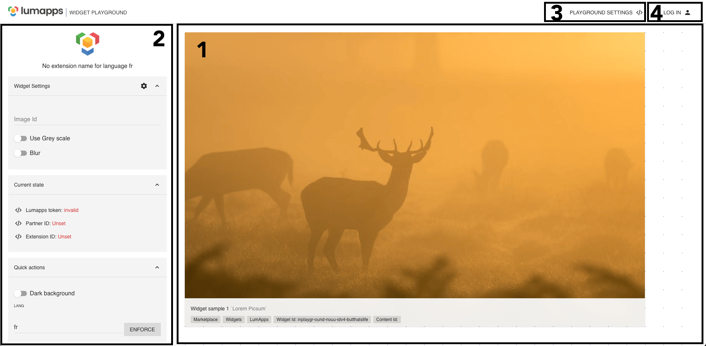

# Playground structure
The LumApps Extension playground is divied in 3 sections : 

## 1. The extension render section
This is the main section of the playground, it render the main component of your extension.

## 2. The side panel
This section contains the settigns of the playground and your extension. 

### Widget settings
In the section you can see and test the widget settings component. 
The set up defined are directly reflected on you widget content.
On the cogwheel you can find the global settings component in a dialog to emulate the administration panel.

### Current state
In the current state section, you'll find the data related to your extension, the provider and extension IDs, and the Lumapps user token you've set in the Playground settings.

### Quick actions
In the quick actions section you can set a user language to test the translation of your extension, and switch to Darl theme to check the render of your extension content composant.
## 3. The Playground settigns
Here you can configure the extension playground.

### Lumapps context
In the playground settings dialog you can set some contextual data.
The LumApps usert token can be set here and used by your extension. You may need to set also the HTTP origin in order to definie on which site your token is valid.
If your extension need to content ID on which it's used, you can emulate it with the setting. 