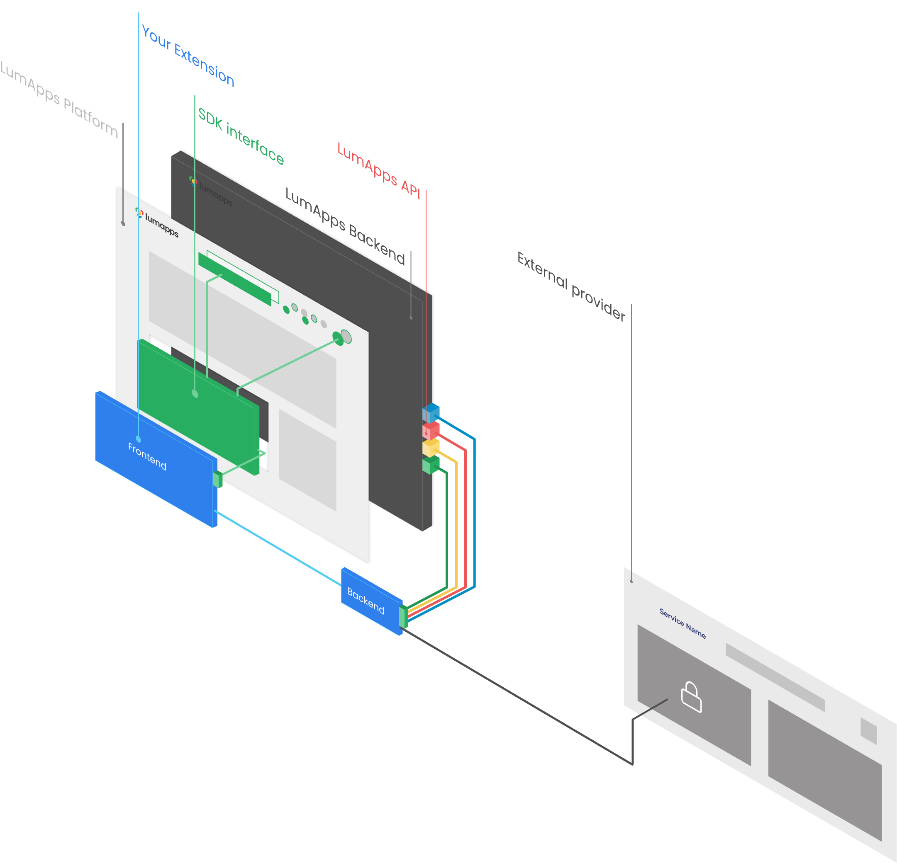

# LumApps SDK

<h6>Table of Contents</h6>

- [LumApps SDK](#lumapps-sdk)
  - [JavaScript SDK](#javascript-sdk)
  - [Python SDK](#python-sdk)

LumApps provide two SDK to ease the development of extension and the integration within the customers LumApps platform.
Each SDK can be used depending on your needs. 

In this schema, the extension is composed of a Frontend and a Backend part. 
 - The Frontend of the extension integrate the JavaScript SDK to have access to contextual information around the extension in LumApps (the connected user, the search engine for example).
 - The Frontend part is connected to the Backend part.
 - The Backend part reaches an external provider to authenticate the user (with OAuth protocol for example), and use the Python SDK to access the LumApps API.

## JavaScript SDK
The JavaScript SDK is used for extensions connected to the LumApps user interface such as widget extensions.
With this SDK you can have access to some contextual information, the connected user, the content where your widget is used, etc.

You can read more in the [JavaScript SDK](sdk-js.md) documentation.

## Python SDK
The Python SDK is currently in a beta, the feature provided can change in future release.

This SDK is mainly used to connect your extension to the LumApps API.

You can read more in the [Python SDK](sdk-back.md) documentation.

