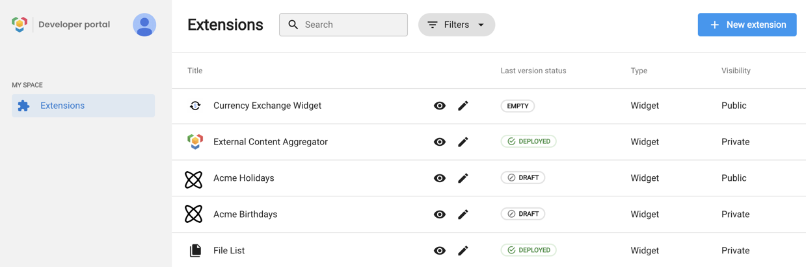

<h6>Table of Contents</h6>

- [Developer Portal](#developer-portal)
- [Login](#login)

# Developer Portal

The developer portal is where you can manage all of your extensions and their versions.

## Login

To log in to the developer portal, you need to use the credentials of your test platform. As a reminder, your test platform is created when you [enroll as a partner](/partner/index). If you are adding user accounts to your test platform, these accounts can also log in to the developer portal.
