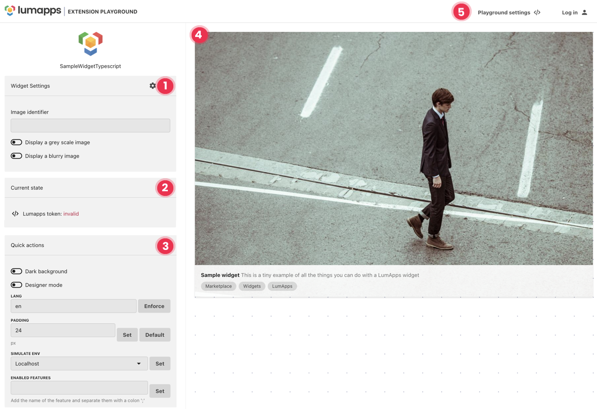
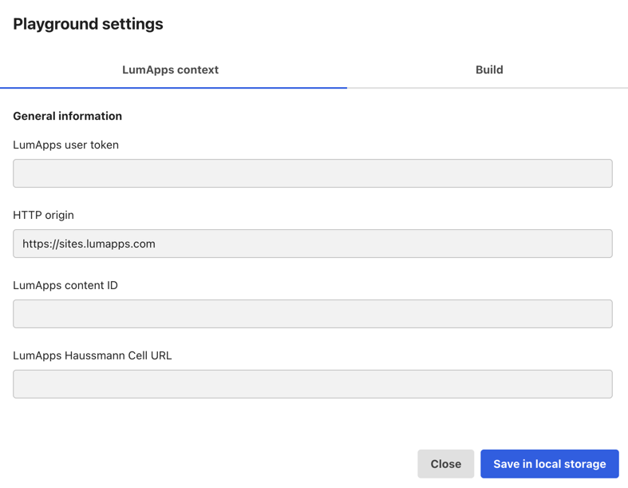

# Playground

The playground offers multiple features to help you develop, test, and interact with the LumApps Marketplace environment.

1.  [Settings](#Settings)  
2.  [Current State](#CurrentState)
3.  [Quick actions](#QuickActions)
4.  [Extension preview](#ExtensionPreview)
5.  [Playground settings](#PlaygroundSettings)

## Settings (opt.)

There are two types of settings available: widget settings and global settings.

**Widget settings** are only available for widget extensions. They are the settings you will display in the LumApps designer that will be used by user adding your widget.

**Global settings** are the configurations applied at the extension level. They are visible in the extension information in the marketplace.

## Current state

When you are logged in, your information is updated.

-   LumApps token: are you logged in your LumApps test platform?
    -   OK - you are logged in.
    -   Invalid - you are not logged in. See the `Log in` button.

## Quick actions

Simulate how it shows in LumApps:

-   Dark background: check how your extension responds to dark mode.
    Lang: display translations (English is by default).
-   Padding: display the extension design with a different padding (24px by default).
-   Simulate env: test actions for different environments (ex: get different API depending on the environment).
-   Feature flag: activate feature flags for development.

## Extension preview

Get a preview of what your extension looks like.

## Playground settings

Clicking Playground settings opens a modal with two tabs.

-   LumApps context:
    -   LumApps user token: this is your token. When you are logged in, the information is already filled in.
    -   HTTP origin: this is your environment. When you are logged in, the information is already filled in.
    -   LumApps content ID: if you want to emulate a real context, you can pull information from a specific content using its ID.
    -   LumApps Haussmann Cell URL: if you want to use our API, you need to fill out this field. The information is available in your Advanced Debug Info administration.
-   Build: create a .zip of your extension. You can upload the .zip in your developer portal.
