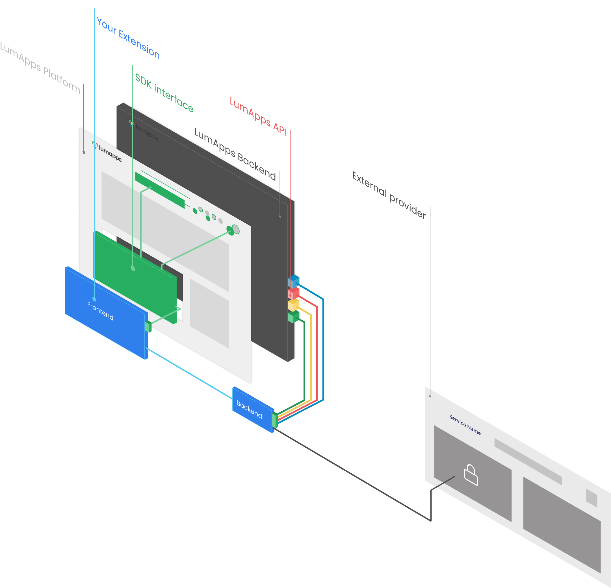

# LumApps SDK/API/Design System

- [LumApps SDK](#lumapps-sdk)
- [LumApps API](#lumapps-api)
- [LumApps Design System](#lumapps-design-system)


# LumApps SDK

-   [LumApps SDK](#lumapps-sdk)
    -   [Python SDK](#python-sdk)
    -   [JavaScript SDK](#javascript-sdk)
        -   [Quick start](#quick-start)
        -   [React hooks](#react-hooks)

LumApps provides two SDK to ease the development of extension and the integration within the customers LumApps platform.
Each SDK can be used depending on your needs.



In this schema, the extension is composed of a Frontend and a Backend part. The Frontend part is connected to the Backend part.

-   The Frontend of the extension integrate the JavaScript SDK to have access to contextual information around the extension in LumApps (the connected user, the search engine for example).
-   The Backend part reaches an external provider to authenticate the user (with OAuth protocol for example), and use the Python SDK to access the LumApps API.

## Python SDK

The Python SDK is currently in beta. tTe feature provided can change in future releases.
This SDK is mainly used to connect your extension to the LumApps API.

You can read more in the [Python SDK](https://lumapps.github.io/lumapps-sdk/) documentation.

## JavaScript SDK

The JavaScript SDK is used for extensions connected to the LumApps user interface such as widget extensions.
With this SDK you can have access to some contextual information, the connected user, the content where your widget is used, etc.

The LumApps JavaScript SDK is a lightweight interface to LumApps for your React components.

### Quick start

Install the SDK with NPM:

```console
$ npm install --save lumapps-sdk-js
```

Import LumApps hooks to use them:

```javascript
import React, { FC, useMemo } from 'react';

import { useCurrentUser, useLanguage } from 'lumapps-sdk-js';

export const HelloWidget: FC = () => {
    const { email, fullName } = useCurrentUser();
    const { displayLanguage } = useLanguage();

    const welcomeMessage = useMemo(() => {
        return (
            <p>
                Hello {fullName}, your email is {email}.
            </p>
        );
    }, [email, fullName]);

    return (
        <>
            {welcomeMessage}
        </>
    );
};
```

### React hooks

To access data from the customer LumApps platform, we provide React hooks in the SDK:

-   [useContext](#usecontext)
-   [useCurrentUser](#usecurrentuser)
-   [useLanguage](#uselanguage)
-   [useOrganization](#useorganization)
-   [useRequest](#userequest)

The SDK also embeds some helpers:

-   [useBooleanState](#usebooleanstate)
-   [useDebounce](#usedebounce)
-   [useExportProps](#useexportprops)

#### useContext

Use this hook to retrieve the context around the widget extension (when added in a LumApps content):

-   contentId
-   instanceId
-   baseUrl
-   environment ('production' or 'development')

```javascript
import React, { FC, useMemo } from 'react';

import { useContext } from 'lumapps-sdk-js';

export const HelloWidget: FC = () => {
    const { contentId, instanceId, baseUrl, environment, isDesignerMode } = useContext();

    const welcomeMessage = useMemo(() => {
        return (
            <p>
                This widget is used in {contentId} in the {instanceId} instance. The environment base URL is : {baseUrl}
            </p>
            <p>
                The environment is {environment}
            </p>
            <p>
                You are on designer mode : {isDesignerMode ? `True`: `False`}
            </p>
        );
    }, [emaicontentIdl, contentId]);

    return (
        <>
            {welcomeMessage}
        </>
    );
};
```

#### useCurrentUser

This hook gives you access to the current user viewing the extension in the customer platform.
With this hook you can access:

-   email
-   first name
-   last name
-   full name
-   thumbnail photo URL
-   token
-   apiProfile
-   accountType

```javascript
import React, { FC, useMemo } from 'react';


import { useCurrentUser } from 'lumapps-sdk-js';

export const HelloWidget: FC = () => {
    const { email, fullName, thumbnailPhotoUrl, apiProfile, accountType } = useCurrentUser();

    const welcomeMessage = useMemo(() => {
        return (
            <div>
                
                <p>
                    Hello {fullName}, your email is {email}.
                </p>
            <div>
        );
    }, [email, fullName]);

    return (
        <>
            {welcomeMessage}
        </>
    );
};
```

#### useLanguage

This hook is used to get the user languages. It's useful to translate your extensions.
You have access to:

-   displayLanguage
-   inputLanguage

```javascript
import React, { FC, useMemo } from 'react';


import { useLanguage } from 'lumapps-sdk-js';

export const HelloWidget: FC = () => {
    const { displayLanguage } = useLanguage();

    const welcomeMessage = useMemo(() => {
        return (
        <IntlProvider locale={displayLanguage} messages={messages[displayLanguage]}>
            <FormattedMessage id="message.id" />
        </IntlProvider>
        );
    }, [displayLanguage]);

    return (
        <>
            {welcomeMessage}
        </>
    );
};
```

#### useOrganization

This hook gives you access to the organization identifier:

-   id
-   slug

```javascript
import React, { FC, useMemo } from 'react';


import { useOrganization } from 'lumapps-sdk-js';

export const HelloWidget: FC = () => {
    const { id } = useOrganization();

    const welcomeMessage = useMemo(() => {
        return (
            <p>
                You are currently in the organization ; {id}.
            </p>
        );
    }, [id]);

    return (
        <>
            {welcomeMessage}
        </>
    );
};
```

#### useFeatureEnabled

This hook tells you if a lumapps feature is enabled or not:

```javascript
import React, { FC, useMemo } from 'react';


import { useFeatureEnabled } from 'lumapps-sdk-js';

export const HelloWidget: FC = () => {
    const isCommunityEnabled = useFeatureEnabled('community');

    const message = useMemo(() => {
        return (
            <p>
                Community feature enabled : {isCommunityEnabled ? 'Yes' : 'No'}.
            </p>
        );
    }, [isCommunityEnabled]);

    return (
        <>
            {message}
        </>
    );
};
```

#### useRequest

This hook is used to contact an OAuth application.

#### useBooleanState

This helper ease the ReactJS useState usage for boolean values.

```tsx
import React, { FC, useMemo } from 'react';
import { ExpansionPanel } from '@lumx/react';

import { useBooleanState } from 'lumapps-sdk-js';

export const HelloWidget: FC = () => {
    const [isPanelOpen, togglePanel, closePanel] = useBooleanState(!parameters.isCollapsed);

    return (
        <ExpansionPanel
            hasBackground
            onClose={closePanel}
            isOpen={isPanelOpen}
            onToggleOpen={togglePanel}
            toggleButtonProps={{ label: 'toggle' }}
        >
            <p>Content</p>
        </ExpansionPanel>
    );
};
```

#### useDebounce

The `useDebounce` helper allows you to debounce any fast changing value.

```tsx
import React, { FC, useMemo } from 'react';
import { ExpansionPanel } from '@lumx/react';
import { callAPI } from './api';

import { useDebounce } from 'lumapps-sdk-js';

export const HelloWidget: FC = () => {
    const [value, setValue] = useState();
    const debouncedValue = useDebounce(value, 800);

    useEffect(() => {
        if (debouncedValue) {
            callApi(debouncedValue);
        }
    }, [debouncedValue]);

    return (
         <div>
            <TextField
                className="mt0 ml"
                label="Value"
                value={value}
                onChange={setValue}
            />
         </div>
    );
};
```

#### useExportProps

This helper can be used to ease the `exportProps` function usage. This function is used to send the settings from a setting component to the content component as props.

This hook required the following properties:

```typescript
/**
 * @param {Object}   value        The Value of the property to set
 * @param {string}   name         The name of the property
 * @param {Object}   props        The property object that regroup ll the properties to send to Content component.
 * @param {Function} exportMethod The fucntion to call to export these properties to the Content component.
 **/
useExportProps = (
    value: any,
    name: string,
    props: any,
    exportMethod: any) => {}
```

```tsx
import React, { FC, useMemo } from 'react';
import { ExpansionPanel } from '@lumx/react';
import { callAPI } from './api';

import { useDebounce, useExportProps } from 'lumapps-sdk-js';

export const HelloWidget: FC = ({ properties = {}, exportProp }: any) => {
    const [value, setValue] = useState();
    const debouncedValue = useDebounce(value, 800);

    useExportProps(debouncedValue, 'value', properties, exportProp);

    return (
         <div>
            <TextField
                className="mt0 ml"
                label="Value"
                value={value}
                onChange={setValue}
            />
         </div>
    );
};
```

# LumApps API

Everything you need to know about the LumApps API is available on our [API Portal](https://apiv1.lumapps.com).

# LumApps Design system

We encourage you to use the LumApps Design System, you can check the [Design System documentation site](https://design.lumapps.com) to find all the component you can import and how to use them.
